# Настройка сценария реагирования: запуск hydra (Linux)

Пошаговое руководство разворачивает сквозной сценарий детектирования и реагирования на компрометацию Linux-хоста, при которой атакующий запускает на нём утилиту подбора паролей `hydra` (MITRE ATT&CK [T1110](https://attack.mitre.org/techniques/T1110/), Brute Force). При обнаружении запуска `hydra` система должна не просто зафиксировать факт, а автоматически собрать контекст на хосте, принудительно завершить сессии скомпрометированной учётной записи и заблокировать её, а после разбора инцидента — восстановить доступ.

Сценарий целиком собирается из стандартных сущностей платформы и связывает их в единую цепочку:

1. **Операции PowerShell** — что агент умеет делать на Linux-хосте по SSH.
2. **Целевой хост** — сервисная учётная запись и SSH-ключи, через которые агент подключается к хосту.
3. **Скрипты** — автоматизации, которые последовательно вызывают операции интеграции по шагам.
4. **Сценарий реагирования** — этапы жизненного цикла инцидента (Идентификация → Локализация → Уничтожение → Восстановление), на каждом из которых запускается свой скрипт.
5. **Правило детектирования** — привязка сценария к конкретному типу инцидента и настройка агрегации.
6. **Тестовая генерация инцидента** — проверка всей цепочки в тестовом контуре.

!!! note "Предварительное условие"
    Во всех операциях этого сценария используется интеграция PowerShell, выполняющая команды на целевом Linux-хосте по SSH. Прежде чем настраивать операции (**Настройки → Интеграции → Операции**), на машине, с которой пойдут SSH-подключения, должен быть установлен **Script Agent**.

## 1. Настройка операций PowerShell

Операции создаются в интеграции PowerShell (**Настройки → Интеграции → Операции**). Каждая операция выполняет одну SSH-команду на целевом хосте от имени сервисной учётной записи агента: `ssh "{{SSHUser}}@{{ComputerName}}""<команда>"`.

При привязке параметров операции к шагу скрипта источник значения выбирается через иконку рядом с полем: **ручной ввод**, **константа** или **входной параметр** (значение берётся из атрибутов события ИБ, переданного в скрипт).

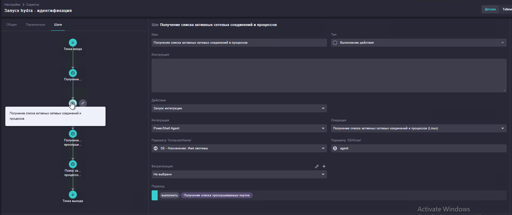

| № | Операция | Роль в сценарии |
|---|---|---|
| 1 | Получение списка активных сетевых соединений и процессов (Linux) | Идентификация |
| 2 | Поиск запущенных процессов и их аргументов (Linux) | Идентификация |
| 3 | Получение списка активных сессий пользователей (Linux) | Идентификация |
| 4 | Получение списка прослушиваемых портов (Linux) | Идентификация |
| 5 | Принудительное завершение процесса (Linux) | Не задействована — доступна для ручного реагирования |
| 6 | Принудительное завершение всех сессий конкретного пользователя (Linux) | Локализация |
| 7 | Блокировка локальной учётной записи пользователя (Linux) | Локализация |
| 8 | Разблокировка локальной учётной записи пользователя (Linux) | Восстановление |

Общие переменные для всех восьми операций: `ComputerName` (строка) — имя/адрес целевого хоста, `SSHUser` (строка) — сервисная учётная запись (УЗ) агента.

### Операция 1. Получение списка активных сетевых соединений и процессов

**Описание:** поиск установленных сетевых соединений на Linux-хосте с определением PID и имён процессов, которые их инициировали (аналог `netstat`).

```bash
ssh "{{SSHUser}}@{{ComputerName}}" "sudo ss -tupn state established"
```

### Операция 2. Поиск запущенных процессов и их аргументов

**Описание:** вывод всех активных процессов на Linux-хосте с отображением PID, PPID, владельца процесса и полной строки запуска.

```bash
ssh "{{SSHUser}}@{{ComputerName}}" "ps -eo pid,ppid,user,args --sort=user"
```

### Операция 3. Получение списка активных сессий пользователей

**Описание:** сбор списка всех пользователей, авторизованных в системе в данный момент, с указанием их tty/pts-терминалов и IP-адресов источников.

```bash
ssh "{{SSHUser}}@{{ComputerName}}" "w"
```

### Операция 4. Получение списка прослушиваемых портов

**Описание:** сканирование открытых портов на Linux-хосте с выводом утилит и служб, ожидающих входящие соединения.

```bash
ssh "{{SSHUser}}@{{ComputerName}}" "sudo netstat -tulnp"
```

### Операция 5. Принудительное завершение процесса

**Описание:** аварийная остановка вредоносного процесса или процесса-майнера на Linux-хосте по его идентификатору (PID) сигналом `SIGKILL` (`-9`).

**Переменные:** `PID` (число) — дополнительно к `ComputerName`, `SSHUser`.

```bash
ssh "{{SSHUser}}@{{ComputerName}}" "sudo kill -9 {{PID}}"
```

!!! tip "Не задействована в сценарии"
    Операция настроена, но ни один из трёх скриптов ниже её не вызывает — сценарий реагирует на уровне пользователя (`pkill -u`), а не отдельного процесса. Она остаётся доступной аналитику для точечного реагирования на этапе «Уничтожение» без полной блокировки учётной записи.

### Операция 6. Принудительное завершение всех сессий конкретного пользователя

**Описание:** экстренное завершение всех процессов и интерактивных SSH-сессий скомпрометированного пользователя — фактически завершает все его активные сеансы в системе.

**Переменные:** `TargetUser` (строка) — дополнительно к `ComputerName`, `SSHUser`.

```bash
ssh "{{SSHUser}}@{{ComputerName}}" "sudo pkill -9 -u {{TargetUser}}"
```

### Операция 7. Блокировка локальной учётной записи пользователя

**Описание:** блокировка пароля пользователя (`usermod -L`) и одновременный перевод учётной записи в статус «истёкшей» (`chage -E 0`). Комбинация этих действий предотвращает вход пользователя в систему как по паролю, так и по SSH-ключам.

**Переменные:** `TargetUser` (строка) — дополнительно к `ComputerName`, `SSHUser`.

```bash
ssh "{{SSHUser}}@{{ComputerName}}" "sudo usermod -L {{TargetUser}} && sudo chage -E 0 {{TargetUser}}"
```

### Операция 8. Разблокировка локальной учётной записи пользователя

**Описание:** восстановление доступа заблокированного или истёкшего локального пользователя. Снимает блокировку пароля и отменяет ограничение срока действия учётной записи — если до блокировки у неё уже был задан свой срок действия, операция его не восстанавливает, а полностью снимает.

**Переменные:** `TargetUser` (строка) — дополнительно к `ComputerName`, `SSHUser`.

```bash
ssh "{{SSHUser}}@{{ComputerName}}" "sudo usermod -U {{TargetUser}} && sudo chage -E -1 {{TargetUser}}"
```

!!! danger "Деструктивные операции"
    Операции 5, 6 и 7 необратимо меняют состояние процессов, сессий или учётной записи в боевой среде (kill процесса, разрыв всех SSH-сессий, блокировка УЗ). В сценарии реагирования они должны запускаться только на этапах **Локализации** и **Восстановления**, никогда — на этапе идентификации.

## 2. Подготовка целевого Linux-хоста

### 2.1. Учётная запись агента

Создать на целевом хосте сервисную учётную запись, от имени которой Script Agent будет подключаться по SSH:

```bash
sudo adduser <agent_username>
```

### 2.2. Права sudo без пароля

Выдать учётной записи право выполнять команды через `sudo` без запроса пароля — иначе каждая операция будет останавливаться на запросе его ввода:

```bash
sudo nano /etc/sudoers
```

В конец файла, **после определения группы `sudo`**, добавить строку:

```
<agent_username>    ALL=(ALL:ALL) NOPASSWD: ALL
```

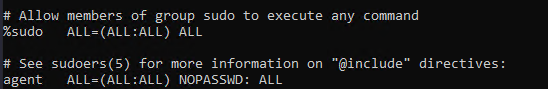

### 2.3. SSH-ключи на машине с агентом

Ключ создаётся **без парольной фразы**, от имени учётной записи, под которой работает служба Script Agent:

```powershell
ssh-keygen -t ed25519
```

Приватный и публичный ключи по умолчанию сохраняются в
`C:\Users\<пользователь>\.ssh`. Публичный ключ переносится на целевой хост:

```powershell
cat .\id_ed25519.pub | ssh agent@10.10.10.10 "cat >> ~/.ssh/authorized_keys"
```

После этого нужно проверить, что подключение по SSH к хосту проходит без запроса пароля.

## 3. Настройка скриптов

Скрипты (**Настройки → Скрипты**) — это оркестрация: каждый шаг вызывает операцию интеграции и передаёт данные дальше по цепочке. Во всех трёх скриптах точка входа принимает один и тот же входной параметр — `se` типа **«Событие ИБ»**. Из него скрипты берут имя системы (`ComputerName`) — во всех операциях, и имя учётной записи (`TargetUser`) — в операциях скриптов локализации и восстановления. Значение `SSHUser` во всех вызовах — константа `<agent_username>`.

### Скрипт 1. «Запуск hydra — идентификация»

Собирает снимок состояния хоста на момент обнаружения `hydra`, ничего не меняя на нём. Шаги выполняются последовательно, каждый — запуск интеграции PowerShell с параметром `ComputerName` = «SE — Назначение: Имя системы» (входной параметр):

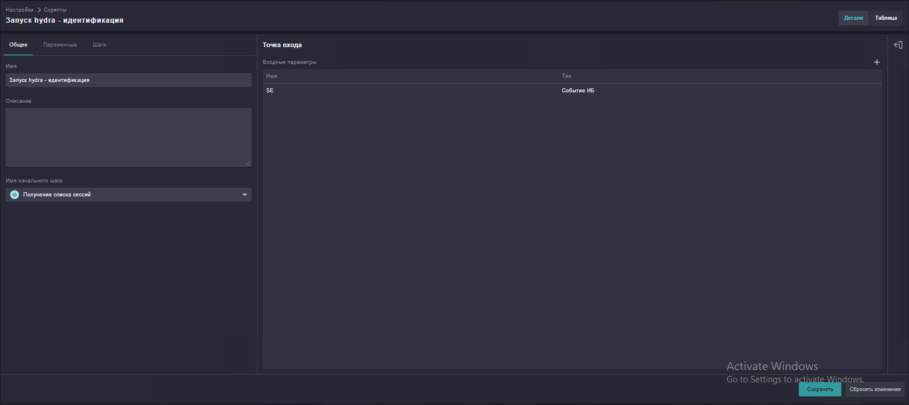

1. Получение списка активных сессий пользователей (Linux)
2. Получение списка активных сетевых соединений и процессов (Linux)
3. Получение списка прослушиваемых портов (Linux)
4. Поиск запущенных процессов и их аргументов (Linux)
5. Переход в точку выхода.

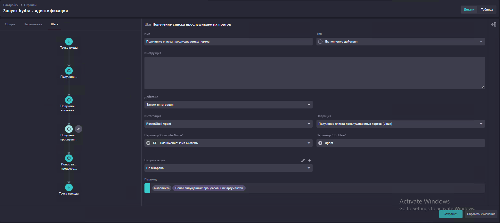
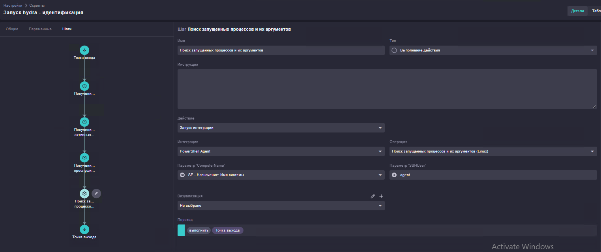

### Скрипт 2. «Запуск hydra — локализация»

Останавливает активность скомпрометированной учётной записи.

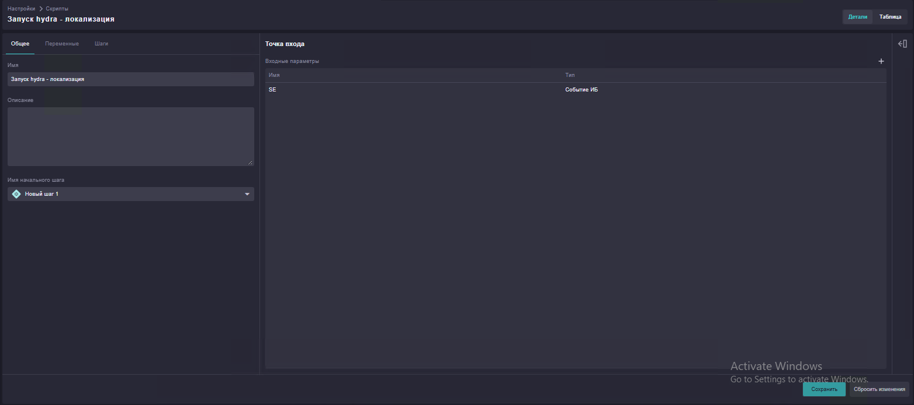
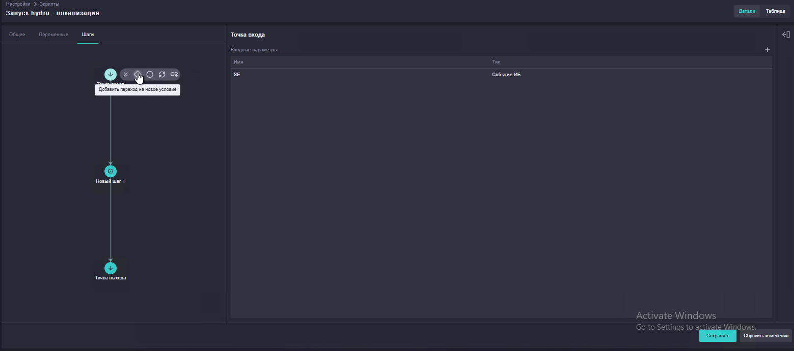

1. **Условие «Проверка УЗ и утилиты»** — выполняется только если одновременно верны оба условия:

    - `SE — Назначение: Имя учётной записи` **does not equal**
      `<agent_username>` — защита от самоблокировки сервисной УЗ агента;
    - `SE — Описание` **contains** `hydra` — подтверждение, что событие
      действительно про эту технику.

    Если условие выполняется — переход к шагу 2, иначе — сразу в точку выхода.

    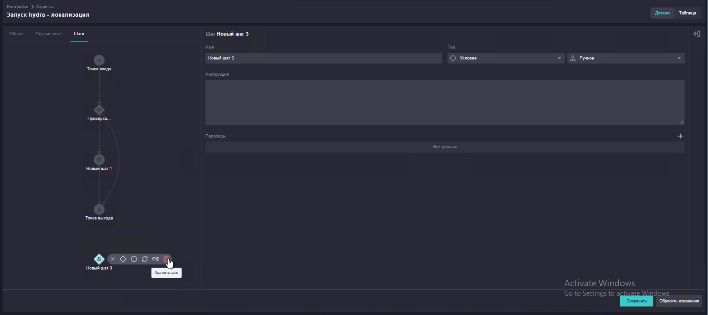

2. **Принудительное завершение всех сессий конкретного пользователя (Linux)** —
   `TargetUser` = «SE — Назначение: Имя учётной записи» (входной параметр).

    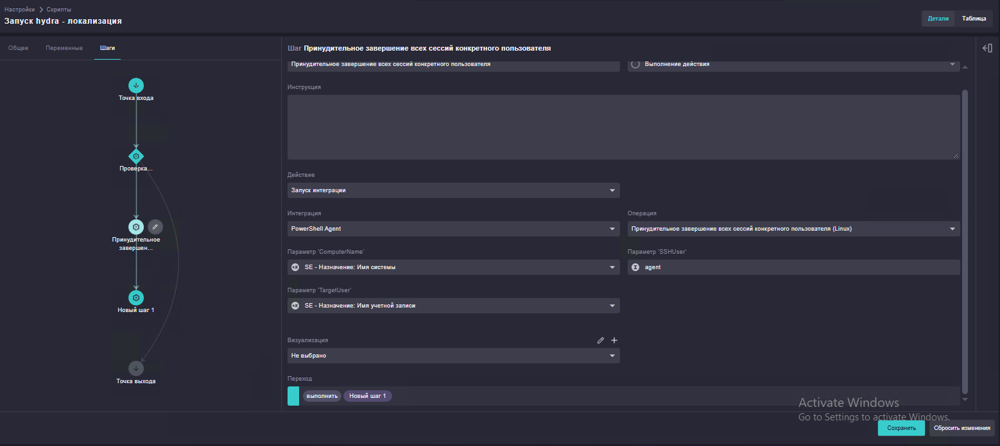

3. **Блокировка локальной учётной записи пользователя (Linux)** — те же параметры.

    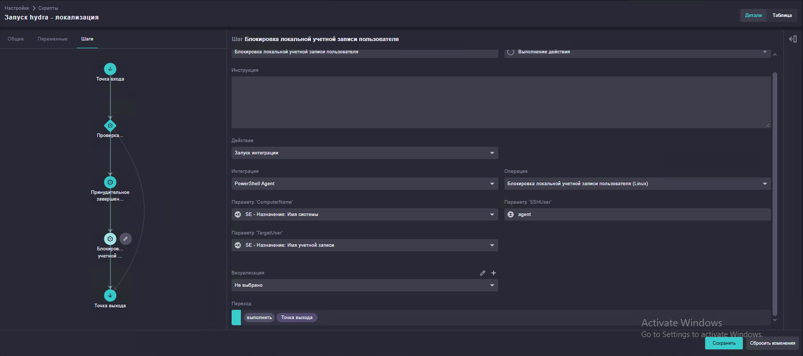

4. Переход в точку выхода.

### Скрипт 3. «Запуск hydra — восстановление»

Возвращает учётную запись в рабочее состояние после разбора инцидента.

1. **Разблокировка локальной учётной записи пользователя (Linux)** —
   `TargetUser` = «SE — Назначение: Имя учётной записи» (входной параметр).

    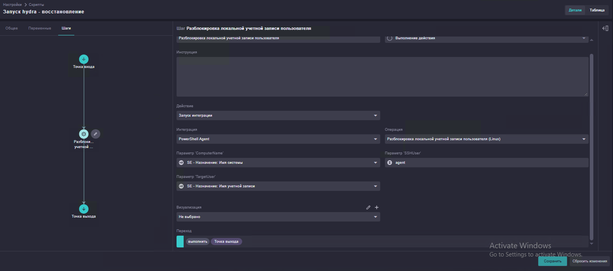

2. Переход в точку выхода.

## 4. Настройка сценария реагирования

Сценарий реагирования (**Работа с инцидентами → Сценарии реагирования**) связывает три скрипта с этапами жизненного цикла инцидента.

**Имя:** Запуск hydra. **Регламент:** Регламент обработки СИБ.

| Этап | Действие | Переход |
|---|---|---|
| Идентификация | Запуск скрипта «Запуск hydra — идентификация» (параметр `se` — Событие ИБ) | → Локализация |
| Локализация | Запуск скрипта «Запуск hydra — локализация» (параметр `se` — Событие ИБ) | → Уничтожение |
| Уничтожение | Действие не задано — точка для ручного решения аналитика | Вручную → Восстановление **или** вручную → Финальный этап |
| Восстановление | Запуск скрипта «Запуск hydra — восстановление» (параметр `se` — Событие ИБ) | → Финальный этап |
| Финальный этап | — | — |

Переходы Идентификация → Локализация → Уничтожение и Восстановление → Финальный этап настроены с типом «По условию», но без единого заданного условия. Такой переход срабатывает каждый раз, когда завершается предыдущий этап, то есть фактически работает как безусловный.

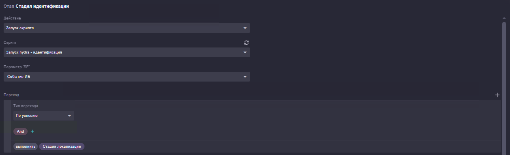
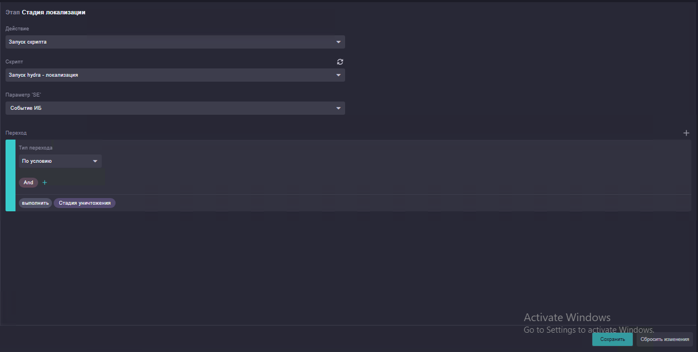
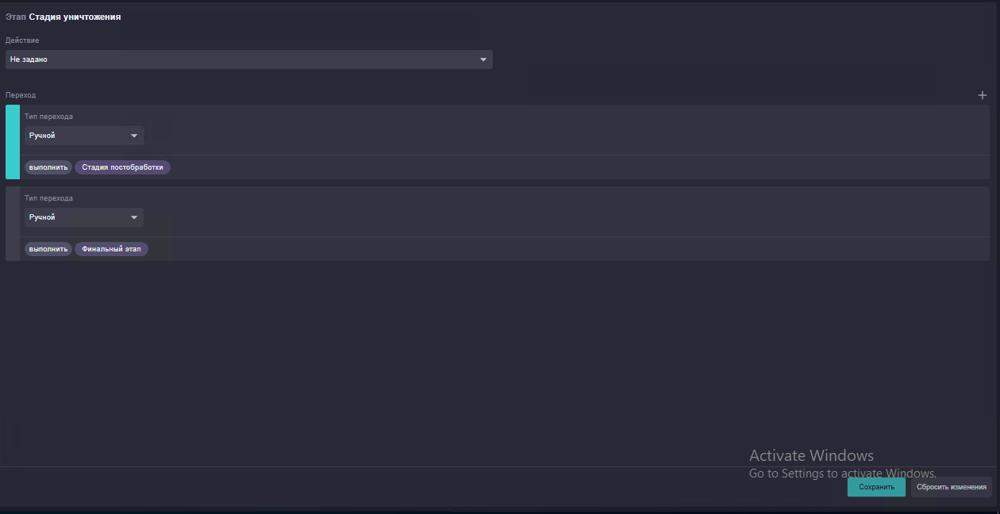
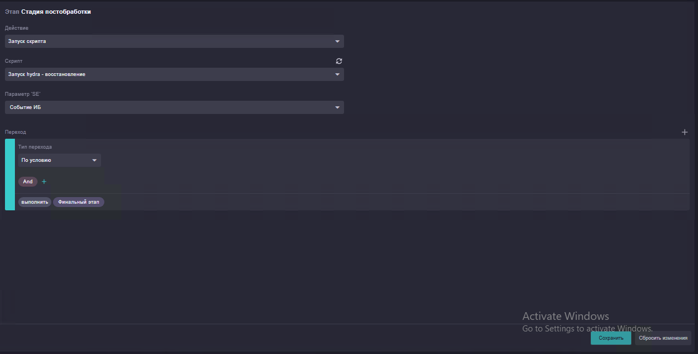

Этап «Уничтожение» намеренно оставлен без автоматизации: устранение первопричины (например, закрытие уязвимости, которой воспользовался атакующий для получения первичного доступа) отдаётся на усмотрение аналитика, а не выполняется автоматически.

## 5. Настройка детектирования СИБ

### 5.1. Правило создания событий ИБ

1. **Работа с инцидентами → Правила создания событий ИБ** → открыть правило
   `WorkFlow_CreateNewSecurityEvent` и включить его.
2. В блоке **«Правила переопределения значений свойств»** добавить условия:

    - `Detection Id` **equals** `INC_010`
    - `Vendor` **equals** `Unix`
    - `Process Command Line` **starts with** `hydra`
    - `Destination User Name` **is not empty**

    → `Сценарий реагирования` = **Запуск hydra**.

    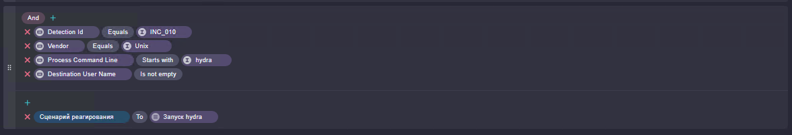

### 5.2. Агрегация инцидента

**Детектирование → Стандартные справочники → `WorkFlow_Incident_Settings_by_Customer`** → найти строку `INC_010` → выставить `AggregationTime` в миллисекундах (например, `10000`), чтобы повторные срабатывания в течение окна агрегации объединялись в один инцидент.

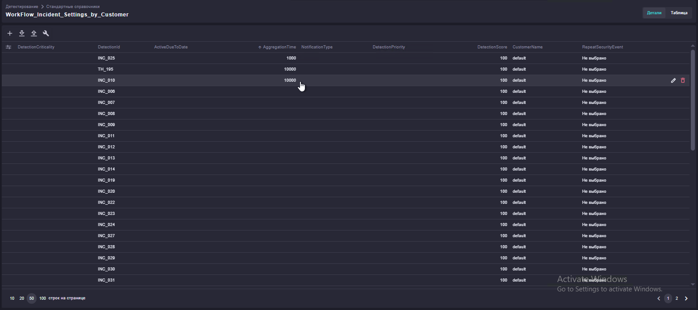

## 6. Генерация тестового инцидента

Проверка всей цепочки — выполнить на целевом хосте команду:

```bash
hydra -h
```

Ключ `-h` выводит только справку по утилите и не выполняет ни одной попытки подключения — реальный перебор паролей при этом не запускается. Но правило детектирования из 5.1 проверяет лишь то, что командная строка процесса начинается с `hydra`, поэтому такой запуск уже удовлетворяет условию и безопасно генерирует тестовое срабатывание, не атакуя реальные системы.

!!! note "Только в тестовом контуре"
    Команда всё равно создаёт на хосте процесс `hydra`, который увидит правило детектирования, — выполняйте проверку на тестовом хосте, чтобы не создавать лишний инцидент в боевой среде.

Ожидаемая цепочка: агент фиксирует запуск процесса `hydra` → правило `WorkFlow_CreateNewSecurityEvent` по условиям из 5.1 создаёт событие ИБ и по `Detection Id = INC_010` привязывает сценарий «Запуск hydra» → инцидент агрегируется по настроенному `AggregationTime` → сценарий реагирования последовательно проходит Идентификацию (сбор сессий, соединений, портов и процессов), Локализацию (завершение сессий и блокировка УЗ) и — после решения аналитика на этапе Уничтожения — Восстановление (разблокировка УЗ).

Если инцидент не создался или сценарий не запустился — в первую очередь проверьте пункт 5.1: это самая частая точка ошибки при повторной настройке сценария.
