# Настройка сценария реагирования: очистка журнала событий (Windows)

Пошаговое руководство разворачивает сквозной сценарий детектирования и
реагирования для одной из самых распространённых техник заметания следов —
очистки журнала событий Windows (MITRE ATT&CK
[T1070.001](https://attack.mitre.org/techniques/T1070/001/), Indicator Removal:
Clear Windows Event Logs). За событием `LogFileCleared` система должна не просто
зафиксировать факт, а автоматически собрать контекст на хосте, изолировать
учётную запись и вернуть её в строй после разбора инцидента.

Сценарий целиком собирается из стандартных сущностей платформы и связывает их в
единую цепочку:

1. **Операции PowerShell** — что агент умеет делать на хосте и в AD.
2. **Визуализации** — как представить данные об авторизациях по инциденту.
3. **Скрипты** — автоматизации, которые дёргают операции и визуализации по шагам.
4. **Сценарий реагирования** — этапы жизненного цикла инцидента (Identification →
   Containment → Eradication → Recovery), на каждом из которых запускается свой скрипт.
5. **Правило детектирования** — привязка сценария к конкретному типу инцидента и
   тонкая настройка агрегации и маппинга полей.
6. **Тестовая генерация инцидента** — проверка всей цепочки вживую.

!!! note "Предварительное условие"
    Во всех операциях этого сценария используется интеграция PowerShell. Прежде чем
    настраивать операции (**Настройки → Интеграции → Операции**), на хосте должен
    быть установлен **Script Agent** — иначе операции будет не к чему привязать.

## 1. Настройка операций PowerShell

Операции создаются в интеграции PowerShell (**Настройки → Интеграции → Операции**).
Ниже — все девять операций сценария: шесть работают с локальным хостом, три — с
Active Directory.

| № | Операция | Область |
|---|---|---|
| 1 | Получение списка активных сетевых соединений и процессов | Windows (хост) |
| 2 | Поиск подозрительных процессов PowerShell | Windows (хост) |
| 3 | Получение списка активных сессий пользователей | Windows (хост) |
| 4 | Принудительное завершение локального процесса | Windows (хост) |
| 5 | Завершение сессии конкретного локального пользователя | Windows (хост) |
| 6 | Поиск заблокированных учётных записей в домене | Windows AD |
| 7 | Аудит администраторов домена и времени их последнего входа | Windows AD |
| 8 | Блокировка/разблокировка УЗ | Windows AD |
| 9 | Экстренный сброс пароля доменного пользователя | Windows AD |

### Операция 1. Получение списка активных сетевых соединений и процессов

**Описание:** поиск подозрительных установленных соединений на сервере агента с
определением процессов, которые их инициировали.

**Переменные:** нет.

```powershell
$connections = foreach ($line in (netstat -ano)) {
    if ($line -match '^\s*(TCP)\s+(\S+)\s+(\S+)\s+(ESTABLISHED)\s+(\d+)\s*$') {
        $local  = $matches[2]
        $remote = $matches[3]
        $p_id   = $matches[5]

        $localPort    = ($local -split ':')[-1]
        $localAddress = ($local -split ":$localPort")[0]
        $remotePort    = ($remote -split ':')[-1]
        $remoteAddress = ($remote -split ":$remotePort")[0]

        $procName = (Get-Process -Id $p_id -ErrorAction SilentlyContinue).Name

        [ordered]@{
            LocalAddress  = $localAddress
            LocalPort     = $localPort
            RemoteAddress = $remoteAddress
            RemotePort    = $remotePort
            Process       = $procName
        }
    }
}

if ($connections) {
    $connections | ConvertTo-Json -Compress
} else {
    "[]"
}
```

### Операция 2. Поиск подозрительных процессов PowerShell

**Описание:** вывод всех активных процессов PowerShell на хосте агента с отображением
полных командных строк запуска — нужно для выявления обфусцированного вредоносного
кода.

**Переменные:** нет.

```powershell
$processes = try {
    $searcher = [wmisearcher]"SELECT ProcessId, CommandLine, ParentProcessId FROM Win32_Process WHERE Name = 'powershell.exe' or Name = 'pwsh.exe'"
    $searcher.Get() | ForEach-Object {
        [ordered]@{
            ProcessId       = $_.Properties['ProcessId'].Value
            CommandLine     = $_.Properties['CommandLine'].Value
            ParentProcessId = $_.Properties['ParentProcessId'].Value
        }
    }
} catch {
    try {
        Get-WmiObject -Class Win32_Process -Filter "Name = 'powershell.exe' or Name = 'pwsh.exe'" | ForEach-Object {
            [ordered]@{
                ProcessId       = $_.ProcessId
                CommandLine     = $_.CommandLine
                ParentProcessId = $_.ParentProcessId
            }
        }
    } catch {
        $wmicOutput = wmic process where "name='powershell.exe' or name='pwsh.exe'" get CommandLine,ParentProcessId,ProcessId /format:csv 2>$null
        if ($wmicOutput) {
            $wmicOutput | Select-Object -Skip 2 | ForEach-Object {
                $parts = $_ -split ',' | Where-Object { $_ }
                if ($parts.Count -ge 3) {
                    [ordered]@{
                        ProcessId       = $parts[-1].Trim()
                        CommandLine     = $parts[1].Trim()
                        ParentProcessId = $parts[2].Trim()
                    }
                }
            }
        }
    }
}

if ($processes) {
    $processes | ConvertTo-Json -Compress
} else {
    "[]"
}
```

!!! tip "Тройной fallback"
    Скрипт последовательно пробует WMI-searcher → `Get-WmiObject` → `wmic`. Это
    защищает операцию от расхождений в возможностях PowerShell/WMI на разных версиях
    Windows и старых образах, где `Get-WmiObject` уже удалён.

### Операция 3. Получение списка активных сессий пользователей

**Описание:** сбор списка всех пользователей, имеющих в данный момент активные RDP
или интерактивные сессии на сервере агента.

**Переменные:** нет.

```powershell
quser 2>$null
```

### Операция 4. Принудительное завершение локального процесса

**Описание:** аварийная остановка вредоносного процесса на хосте агента по его имени.

**Переменные:** `ProcessName` (строка).

```powershell
Stop-Process -Name "{{ProcessName}}" -Force
```

### Операция 5. Завершение сессии конкретного локального пользователя

**Описание:** принудительный сброс активного RDP-подключения пользователя на хосте
агента.

**Переменные:** `Username` (строка).

```powershell
$session = (quser | Select-String "{{Username}}").ToString() -split ' +'
logoff $session[2]
```

### Операция 6. Поиск заблокированных учётных записей в домене

**Описание:** выявление учётных записей пользователей, заблокированных в домене
из-за превышения попыток ввода пароля.

**Переменные:** нет.

```powershell
Search-ADAccount -AccountDisabled | Select-Object SamAccountName, Name, LockedOut
```

!!! warning "На проверку"
    Название операции и выбираемое поле `LockedOut` говорят о поиске
    **заблокированных из-за неверного пароля** учётных записей, а ключ
    `-AccountDisabled` в `Search-ADAccount` возвращает **отключённые** учётные
    записи — это разные состояния объекта в AD. Возможно, здесь имелся в виду ключ
    `-LockedOut`. Перед использованием операции в проде стоит сверить с автором
    сценария, какое поведение задумывалось изначально.

### Операция 7. Аудит администраторов домена и времени их последнего входа

**Описание:** сбор списка учётных записей из группы «Domain Admins» с проверкой
времени их последней аутентификации.

**Переменные:** нет.

```powershell
Get-ADGroupMember -Identity "Domain Admins" |
    ForEach-Object { Get-ADUser -Identity $_.SamAccountName -Properties LastLogonDate } |
    Select-Object SamAccountName, Name, LastLogonDate, Enabled
```

### Операция 8. Блокировка/разблокировка УЗ

**Описание:** блокировка или разблокировка учётной записи в домене.

**Переменные:** `Username` (строка), `Enabled` (логический).

```powershell
Set-ADUser -Identity {{Username}} -Enabled ${{Enabled}}
```

### Операция 9. Экстренный сброс пароля доменного пользователя

**Описание:** смена пароля пользователя на случайный временный с требованием
обязательной смены при следующем входе в сеть.

**Переменные:** `Username` (строка), `TempPassword` (строка).

```powershell
$SecPassword = ConvertTo-SecureString "{{TempPassword}}" -AsPlainText -Force
Set-ADAccountPassword -Identity "{{Username}}" -NewPassword $SecPassword -Reset
Set-ADUser -Identity "{{Username}}" -ChangePasswordAtLogon $true
```

!!! danger "Деструктивные операции"
    Операции 4, 5, 8 и 9 необратимо меняют состояние хоста, сессии или учётной
    записи в проде (kill процесса, разрыв RDP-сессии, блокировка УЗ, сброс пароля).
    В сценарии реагирования они должны запускаться только на этапах **Локализации**
    и **Восстановления**, никогда — на этапе идентификации.

## 2. Настройка визуализаций

Визуализации настраиваются в **Настройки → Визуализации** и используются скриптами
идентификации, чтобы приложить к инциденту наглядную картину авторизаций на хосте.

### Визуализация 1. «Авторизация на хосте — круговая диаграмма»

| Блок | Параметр | Значение |
|---|---|---|
| Общее | Имя | Авторизация на хосте - круговая диаграмма |
| Схема данных | Тип источника | Анализ данных |
| Настройки | Тип | Круговая диаграмма |
| Настройки | Поле | Destination User Name |
| Настройки | Метрика | Count |
| Настройки | Аргумент метрики | All rows |

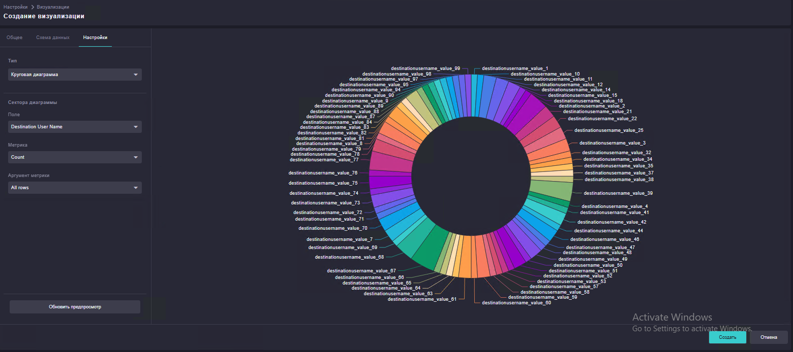

### Визуализация 2. «Авторизация на хосте — столбчатая диаграмма»

| Блок | Параметр | Значение |
|---|---|---|
| Общее | Имя | Авторизация на хосте - Столбчатая диаграмма |
| Схема данных | Тип источника | Анализ данных |
| Настройки | Тип | Столбчатая диаграмма с накоплением |
| Горизонтальная ось | Поле | Collected Date |
| Горизонтальная ось | Интервал группировки | Час |
| Горизонтальная ось | Сортировка / порядок | Collected Date, по возрастанию |
| Вертикальная ось | Агрегатные функции | count all rows |
| Серия | Поле | Destination User Name |

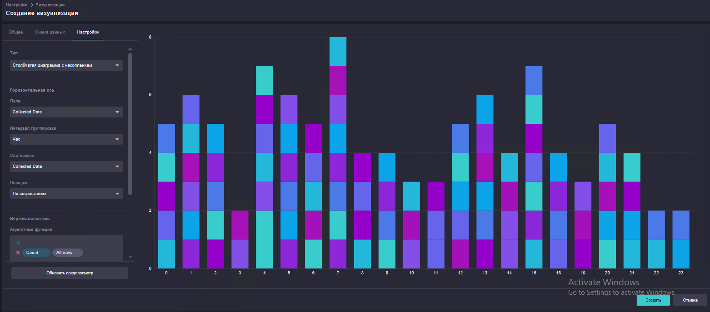

## 3. Настройка скриптов

Скрипты (**Настройки → Скрипты**) — это оркестрация: каждый шаг вызывает операцию
интеграции или визуализацию и передаёт данные дальше по цепочке. Во всех трёх
скриптах точка входа принимает один и тот же входной параметр — `se` типа
**«Событие ИБ»**, то есть сработавшее событие `LogFileCleared`, из которого скрипты
достают имя хоста и имя учётной записи.

### Скрипт 1. «Очистка журнала — идентификация»

Собирает контекст вокруг события, ничего не меняя на хосте.

**Переменные скрипта:**

| Имя | Тип | Значение |
|---|---|---|
| `$Now` | Дата и время | `now()` |
| `$From` | Дата и время | `addHours($Now, -24)` |

**Точка входа:** параметр `se`, тип «Событие ИБ».

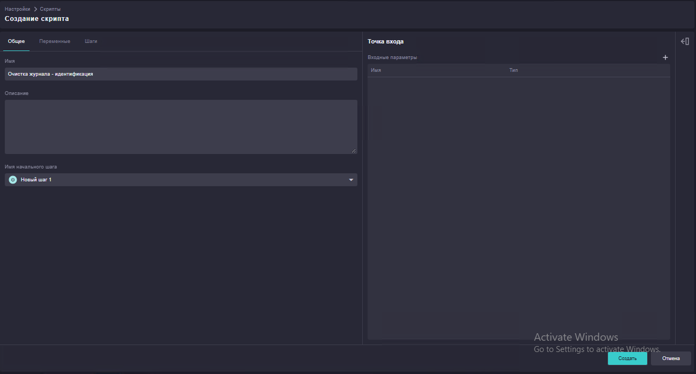
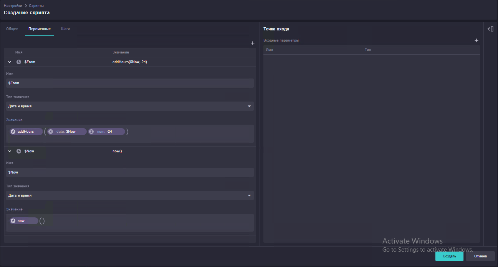
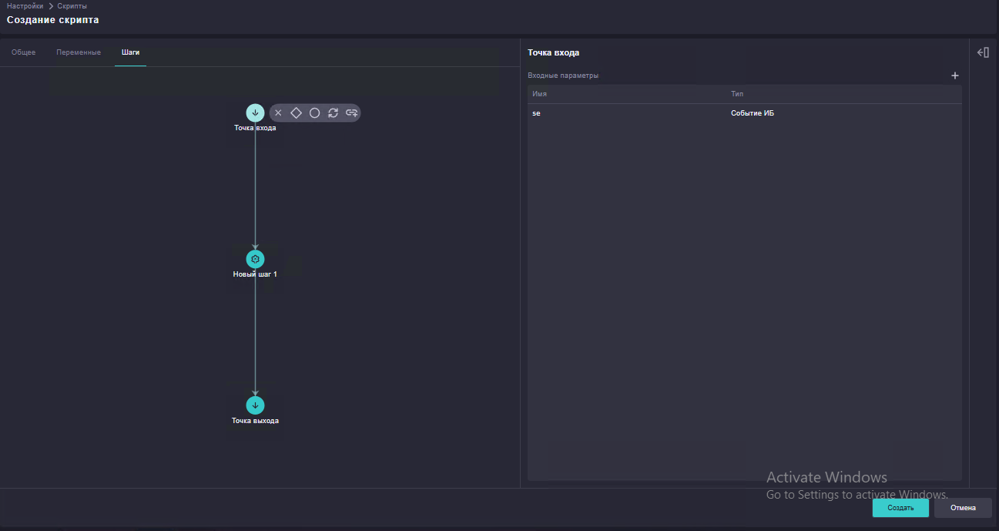

**Шаги:**

1. **Получение активных сессий на хосте** — запуск интеграции PowerShell, операция
   «Получение списка активных сессий пользователей».

    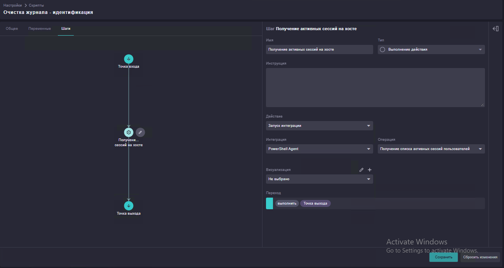

2. **Авторизации на хосте — круговая диаграмма** — запуск интеграции «Анализ
   данных», операция «Получить значения из анализа данных», визуализация —
   круговая диаграмма из блока 2. Параметры:
     - `offset` = `0` (константа), `limit` = `1000` (константа);
     - `fromdate` = `$From`, `todate` = `$Now` (переменные);
     - фильтр: `Destination Host ID equals se` (имя системы из входного события)
       **или** `Event ID equals 4624` (успешный вход, константа).

    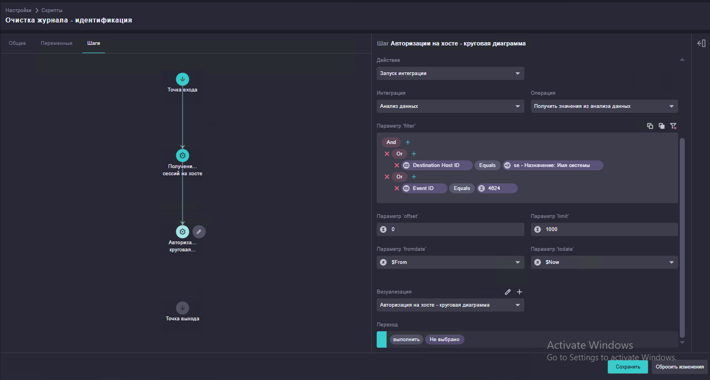

3. **Авторизации на хосте — столбчатая диаграмма** — тот же вызов «Получить
   значения из анализа данных» с идентичными фильтром и параметрами, но с
   визуализацией-столбчатой диаграммой из блока 2 (скриншот этого шага не
   приводим — он совпадает с предыдущим с точностью до выбранной визуализации).

4. **Получение списка активных сетевых соединений и процессов** — запуск
   интеграции PowerShell, операция «Получение списка активных сетевых соединений и
   процессов».

    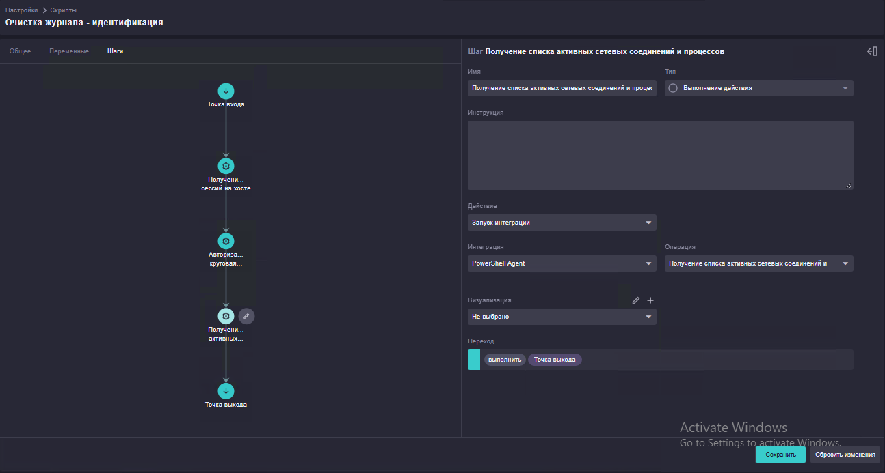

5. Переход в точку выхода.

### Скрипт 2. «Очистка журнала — локализация»

Останавливает активность скомпрометированной учётной записи.

**Точка входа:** параметр `se`, тип «Событие ИБ».

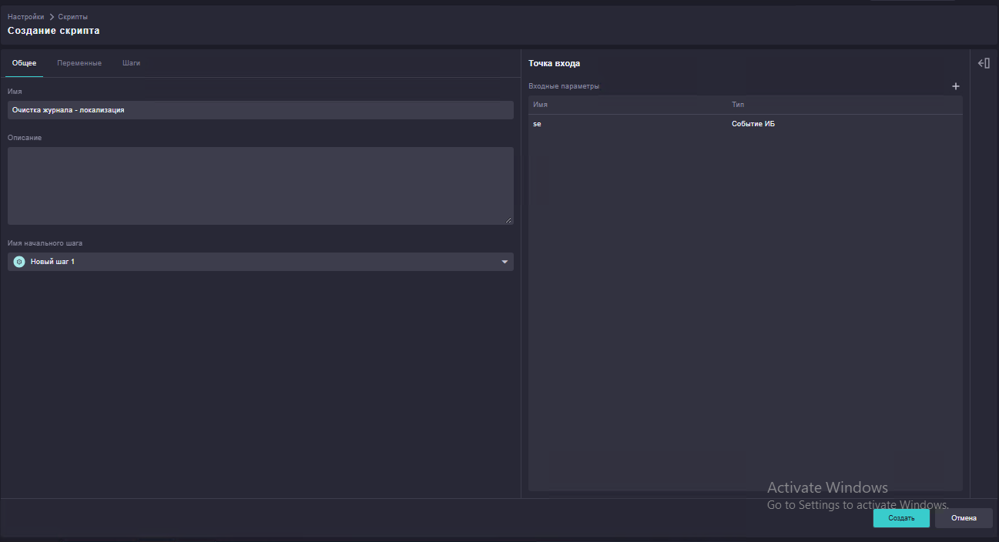

**Шаги:**

1. **Завершение сессии пользователя** — запуск интеграции PowerShell, операция
   «Завершение сессии конкретного локального пользователя». Параметр `Username` =
   `se` (источник — имя учётной записи из входного параметра).

    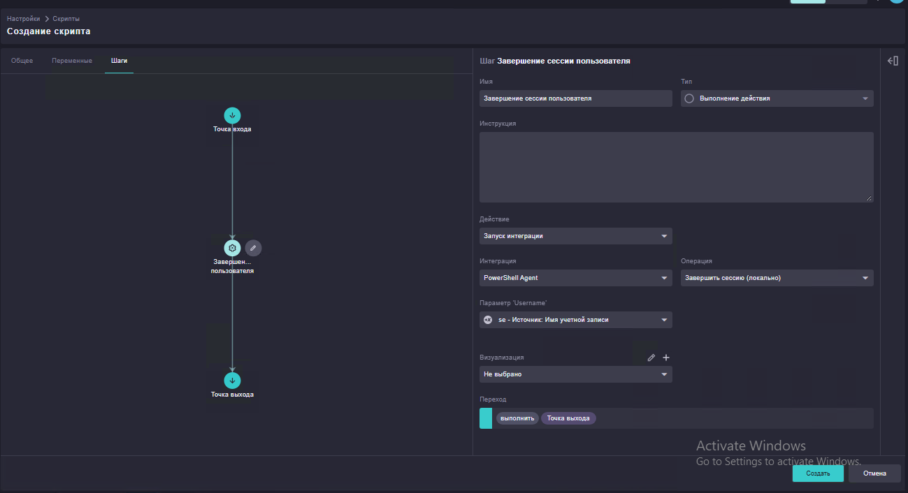

2. **Блокировка доменной УЗ пользователя** — запуск интеграции PowerShell, операция
   «Блокировка/разблокировка УЗ». Параметр `Username` = `se` (имя учётной записи),
   `Enabled` = `false` (константа).

    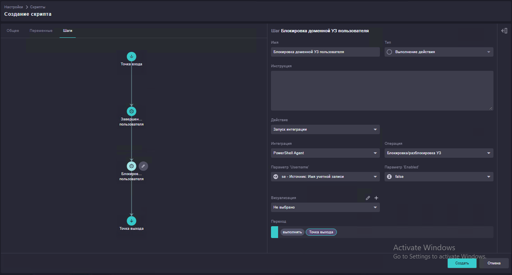

3. Переход в точку выхода.

### Скрипт 3. «Очистка журнала — восстановление»

Возвращает учётную запись в рабочее состояние после разбора инцидента.

**Точка входа:** параметр `se`, тип «Событие ИБ».

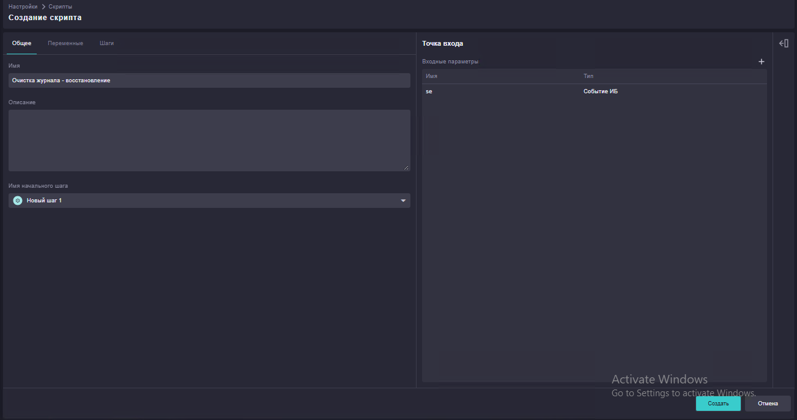

**Шаги:**

1. **Разблокировка доменной УЗ пользователя** — запуск интеграции PowerShell,
   операция «Блокировка/разблокировка УЗ». Параметр `Username` = `se` (имя учётной
   записи), `Enabled` = `true` (константа).

    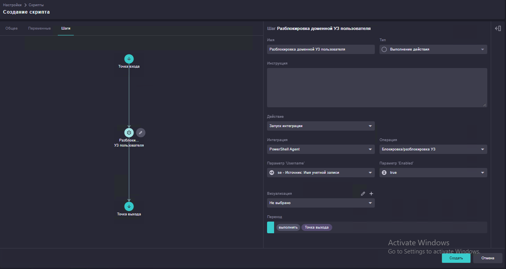

2. Переход в точку выхода.

## 4. Настройка сценария реагирования

Сценарий реагирования (**Работа с инцидентами → Сценарии реагирования**) связывает
три скрипта с этапами жизненного цикла инцидента.

**Имя:** Очистка журнала. **Регламент:** Регламент обработки СИБ.

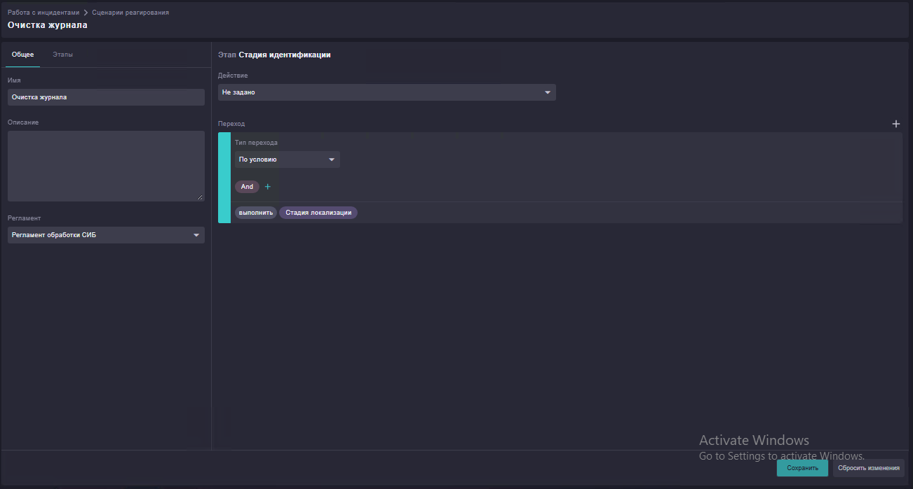

| Этап | Действие | Переход |
|---|---|---|
| Идентификация | Запуск скрипта «Очистка журнала — идентификация» (параметр `se` — Событие ИБ) | По условию (безусловно) → Локализация |
| Локализация | Запуск скрипта «Очистка журнала — локализация» (параметр `se` — Событие ИБ) | По условию (безусловно) → Уничтожение |
| Уничтожение | Действие не задано — точка для ручного решения аналитика | Вручную → Восстановление **или** вручную → Финальный этап |
| Восстановление | Запуск скрипта «Очистка журнала — восстановление» (параметр `se` — Событие ИБ) | По условию (безусловно) → Финальный этап |
| Финальный этап | — | — |

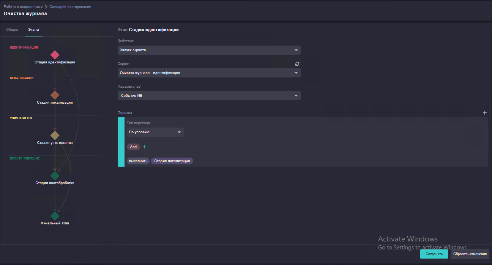
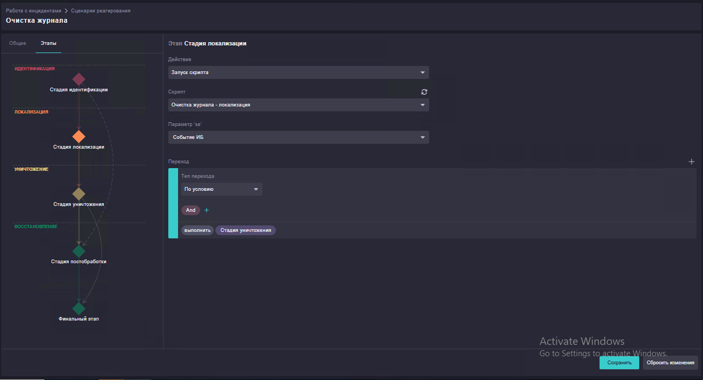
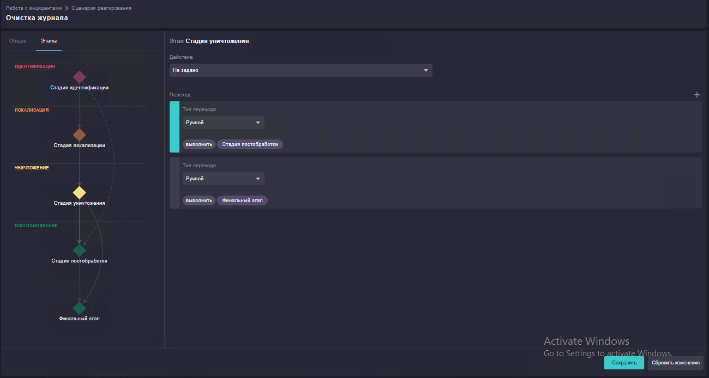
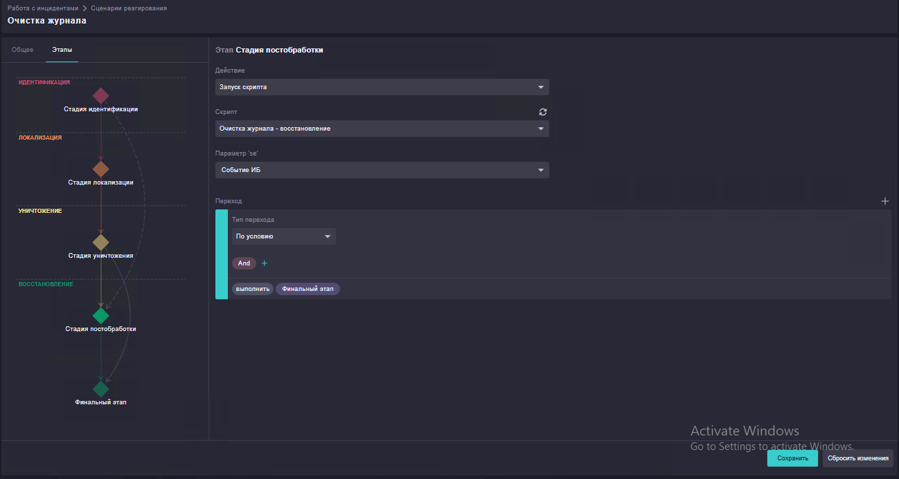

Этап «Уничтожение» намеренно оставлен без автоматизации: сброс пароля (операция 9)
или другие деструктивные шаги отдаются на усмотрение аналитика после того, как
идентификация подтвердила инцидент, а не выполняются автоматически.

## 5. Настройка детектирования СИБ

Три точки конфигурации нужно свести вместе, чтобы событие `LogFileCleared`
превращалось в инцидент с уже привязанным сценарием реагирования.

### 5.1. Правило создания событий ИБ

1. **Работа с инцидентами → Правила создания событий ИБ** → открыть правило
   `WorkFlow_CreateNewSecurityEvent` и включить его.
2. В блоке **«Правила переопределения значений свойств»** добавить условие:
   `Detection Id equals INC_025` → `Сценарий реагирования` = **Очистка журнала**.

    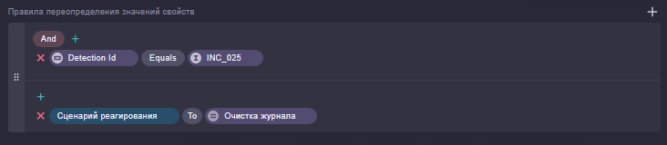

### 5.2. Агрегация инцидента

**Детектирование → Стандартные справочники → `WorkFlow_Incident_Settings_by_Customer`**
→ найти строку `INC_025` → выставить `AggregationTime` в миллисекундах (например,
`1000`).

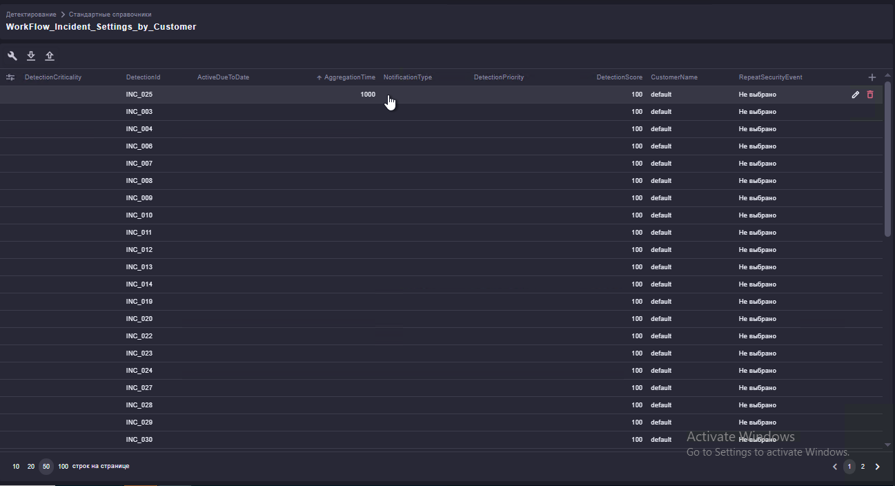

### 5.3. Профиль сопоставления полей

**Источники и сбор событий → Профили сопоставления → Microsoft Windows → Поля
модели события → Source User Name.**

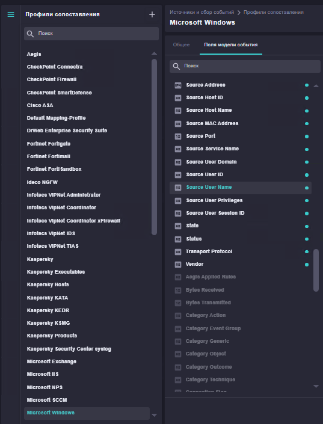

В выражениях справа нужно найти `#lower_LogFileCleared_SubjectUserName` и заменить
его значение с `lower(winlog.user_data.SubjectUserName)` на:

```
winlog.user_data.SubjectUserName
```

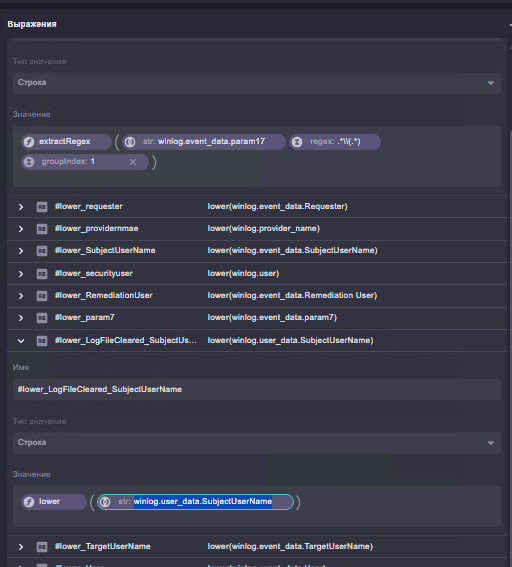

!!! warning "Не перепутайте выражение"
    В списке выражений профиля соседствуют похожие имена (`#lower_requester`,
    `#lower_SubjectUserName`, `#lower_securityuser` и т. д.) — редактируется именно
    `#lower_LogFileCleared_SubjectUserName`. Уберите обёртку `lower(...)` целиком,
    иначе имя пользователя в модели события окажется в нижнем регистре и не
    совпадёт с реальным `SamAccountName`, который скрипты передают операциям AD.

Сохраните изменения профиля.

## 6. Генерация тестового инцидента

Проверка всей цепочки — сымитировать саму технику атаки на хосте, где установлен
Script Agent:

1. Откройте **Event Viewer**.

    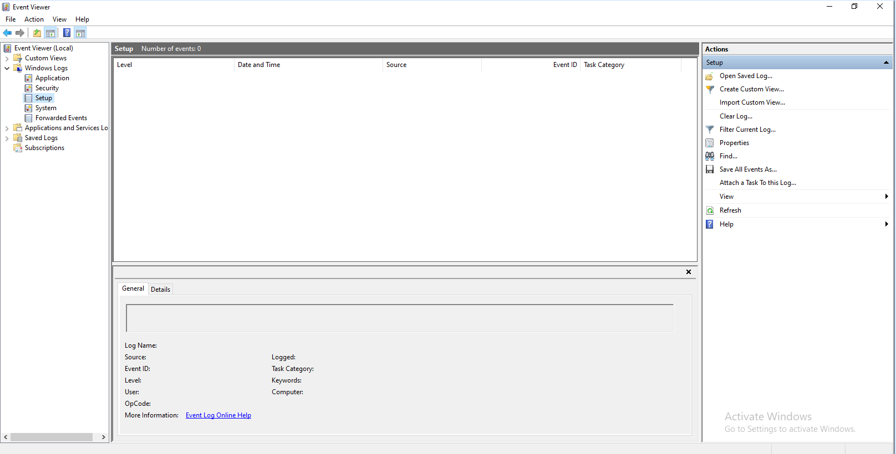

2. В дереве слева выберите любой журнал (например, «Setup»), нажмите правой кнопкой
   мыши и выберите **Clear Log…**

    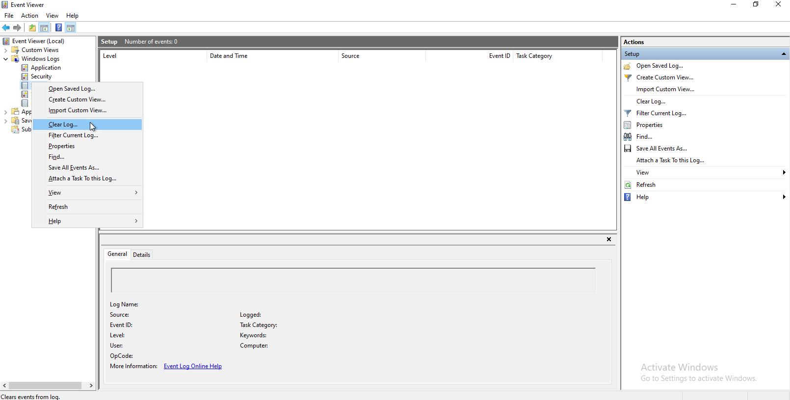

3. В диалоге подтверждения нажмите **Clear**.

    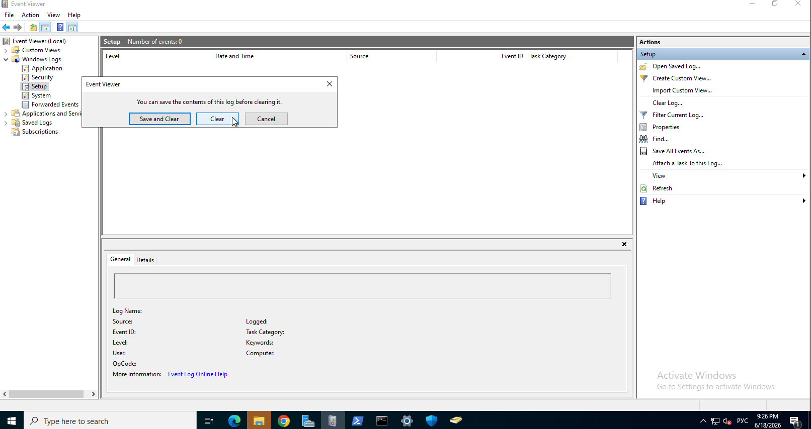

!!! danger "Только в тестовом контуре"
    Очистка журнала событий — это то самое действие (Windows Event ID `1102`,
    «The audit log was cleared»), которое сценарий должен детектировать. Выполняйте
    шаг исключительно на тестовом хосте: это симуляция действий злоумышленника, а
    не рутинная операция обслуживания.

После этого действия ожидаемая цепочка выглядит так: агент собирает событие
`LogFileCleared` → профиль сопоставления «Microsoft Windows» подставляет имя
учётной записи из `winlog.user_data.SubjectUserName` → правило
`WorkFlow_CreateNewSecurityEvent` создаёт событие ИБ и по `Detection Id = INC_025`
привязывает сценарий «Очистка журнала» → инцидент агрегируется по настроенному
`AggregationTime` → сценарий реагирования последовательно проходит
Идентификацию (сбор сессий, авторизаций и сетевых соединений), Локализацию
(завершение сессии и блокировка УЗ) и — после решения аналитика на этапе
Уничтожения — Восстановление (разблокировка УЗ).

Если инцидент не создался или сценарий не запустился — в первую очередь проверьте
пункты 5.1–5.3: это самые частые точки ошибки при повторной настройке сценария.
