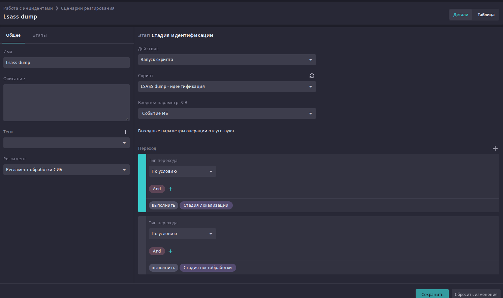
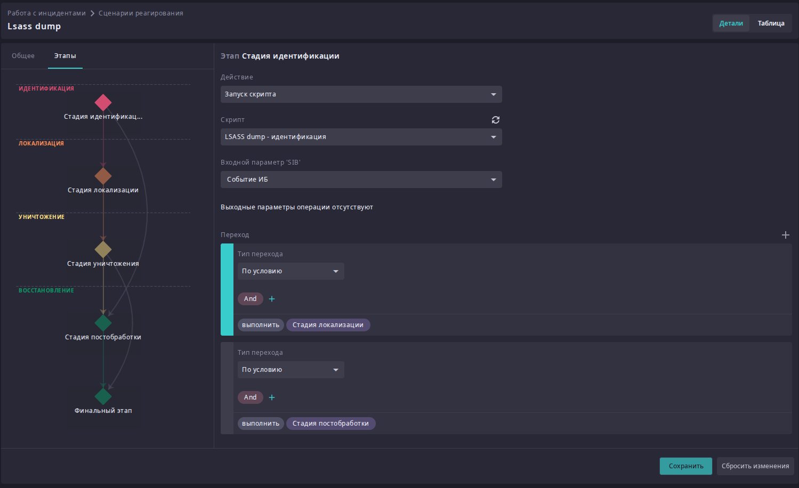
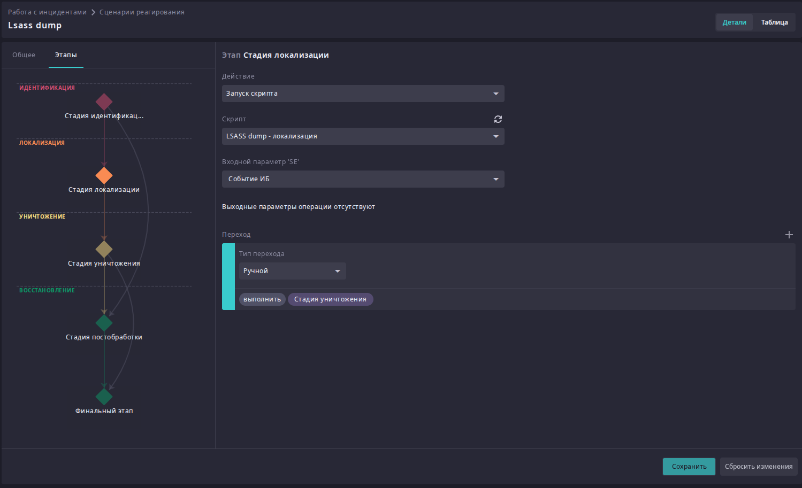
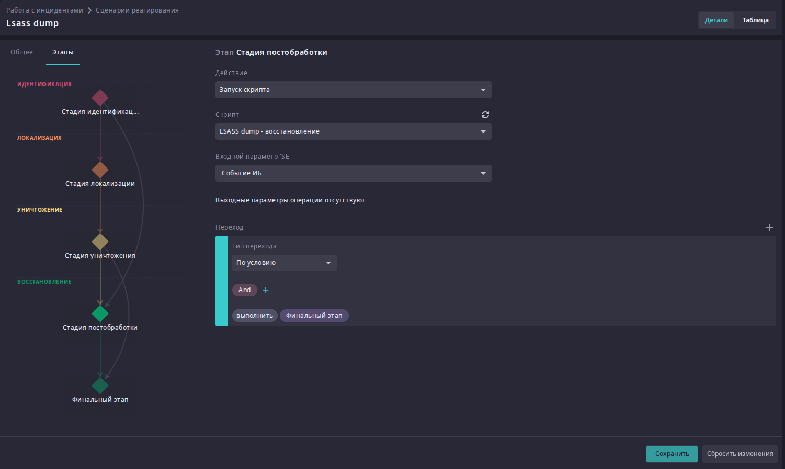
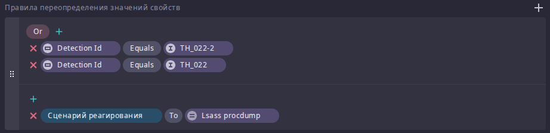
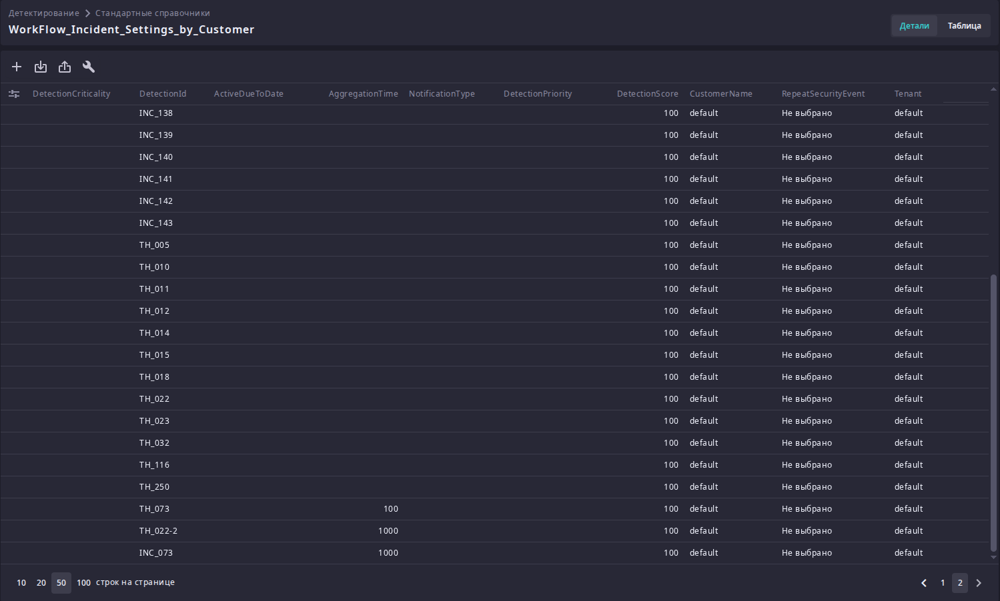

# Настройка сценария реагирования: LSASS dump

Пошаговое руководство разворачивает сквозной сценарий детектирования и
реагирования для одной из самых распространённых техник заметания следов —
очистки журнала событий Windows (MITRE ATT&CK
[T1070.001](https://attack.mitre.org/techniques/T1003/001/), OS Credential Dumping: LSASS Memory 

Сценарий целиком собирается из стандартных сущностей платформы и связывает их в
единую цепочку:

1. **Операции PowerShell** — что агент умеет делать на хосте и в AD.
2. **Визуализации** — как представить данные об авторизациях по инциденту.
3. **Скрипты** — автоматизации, которые дёргают операции и визуализации по шагам.
4. **Сценарий реагирования** — этапы жизненного цикла инцидента (Identification →
   Containment → Eradication → Recovery), на каждом из которых запускается свой скрипт.
5. **Правило детектирования** — привязка сценария к конкретному типу инцидента и
   тонкая настройка агрегации и маппинга полей.
6. **Тестовая генерация инцидента** — проверка всей цепочки вживую.

!!! note "Предварительное условие"
    Во всех операциях этого сценария используется интеграция PowerShell. Прежде чем
    настраивать операции (**Настройки → Интеграции → Операции**), на хосте должен
    быть установлен **Script Agent** — иначе операции будет не к чему привязать.

## 1. Настройка операций PowerShell

Операции создаются в интеграции PowerShell (**Настройки → Интеграции → Операции**).
Ниже — все девять операций сценария: шесть работают с локальным хостом, три — с
Active Directory.

| № | Операция | Область |
|---|---|---|
| 1 | Блокировка/разблокировка УЗ | Windows AD |
| 2 | Завершение сессии конкретного локального пользователя | Windows (хост) |
| 3 | Получение списка активных сетевых соединений и процессов | Windows (хост) |

### 1. Операция Блокировка/разблокировка УЗ

**Описание:** блокировка или разблокировка учётной записи в домене.

**Переменные:** `Username` (строка), `Enabled` (логический).

```powershell
Set-ADUser -Identity {{Username}} -Enabled ${{Enabled}}
```

### 2. Завершение сессии конкретного локального пользователя

**Описание:** принудительный сброс активного RDP-подключения пользователя на хосте
агента.

**Переменные:** `Username` (строка).

```powershell
$session = (quser | Select-String "{{Username}}").ToString() -split ' +'
logoff $session[2]
```
### Операция 3. Получение списка активных сетевых соединений и процессов

**Описание:** поиск подозрительных установленных соединений на сервере агента с
определением процессов, которые их инициировали.

**Переменные:** нет.

```powershell
$connections = foreach ($line in (netstat -ano)) {
    if ($line -match '^\s*(TCP)\s+(\S+)\s+(\S+)\s+(ESTABLISHED)\s+(\d+)\s*$') {
        $local  = $matches[2]
        $remote = $matches[3]
        $p_id   = $matches[5]

        $localPort    = ($local -split ':')[-1]
        $localAddress = ($local -split ":$localPort")[0]
        $remotePort    = ($remote -split ':')[-1]
        $remoteAddress = ($remote -split ":$remotePort")[0]

        $procName = (Get-Process -Id $p_id -ErrorAction SilentlyContinue).Name

        [ordered]@{
            LocalAddress  = $localAddress
            LocalPort     = $localPort
            RemoteAddress = $remoteAddress
            RemotePort    = $remotePort
            Process       = $procName
        }
    }
}

if ($connections) {
    $connections | ConvertTo-Json -Compress
} else {
    "[]"
}
```

## 2. Настройка визуализаций

Визуализации настраиваются в **Настройки → Визуализации** и используются скриптами
идентификации, чтобы приложить к инциденту наглядную картину авторизаций на хосте.

### Визуализация 1. «Авторизация на хосте — круговая диаграмма»

| Блок | Параметр | Значение |
|---|---|---|
| Общее | Имя | Авторизация на хосте - круговая диаграмма |
| Схема данных | Тип источника | Анализ данных |
| Настройки | Тип | Круговая диаграмма |
| Настройки | Поле | Destination User Name |
| Настройки | Метрика | Count |
| Настройки | Аргумент метрики | All rows |


### Визуализация 2. «Авторизация на хосте — столбчатая диаграмма»

| Блок | Параметр | Значение |
|---|---|---|
| Общее | Имя | Авторизация на хосте - Столбчатая диаграмма |
| Схема данных | Тип источника | Анализ данных |
| Настройки | Тип | Столбчатая диаграмма с накоплением |
| Горизонтальная ось | Поле | Collected Date |
| Горизонтальная ось | Интервал группировки | Час |
| Горизонтальная ось | Сортировка / порядок | Collected Date, по возрастанию |
| Вертикальная ось | Агрегатные функции | count all rows |
| Серия | Поле | Destination User Name |

## 3. Настройка скриптов

Скрипты (**Настройки → Скрипты**) — это оркестрация: каждый шаг вызывает операцию
интеграции или визуализацию и передаёт данные дальше по цепочке. Во всех трёх
скриптах точка входа принимает один и тот же входной параметр — `SIB` типа
**«Событие ИБ»**, то есть сработавшее событие `Lsass Dump`, из которого скрипты
достают имя хоста и имя учётной записи.

### Скрипт 1. «Lsass dump — идентификация»

Собирает контекст вокруг события, ничего не меняя на хосте.

**Переменные скрипта:**

| Имя | Тип | Значение |
|---|---|---|
| `$Now` | Дата и время | `now()` |
| `$From` | Дата и время | `addHours($Now, -24)` |

**Точка входа:** параметр `se`, тип «Событие ИБ».


**Шаги:**

1. **Получение активных сессий на хосте** — запуск интеграции PowerShell, операция
   «Получение списка активных сессий пользователей».

    

2. **Авторизации на хосте — круговая диаграмма** — запуск интеграции «Анализ
   данных», операция «Получить значения из анализа данных», визуализация —
   круговая диаграмма из блока 2. Параметры:
     - `offset` = `0` (константа), `limit` = `1000` (константа);
     - `fromdate` = `$From`, `todate` = `$Now` (переменные);
     - фильтр: `Destination Host ID equals se` (имя системы из входного события)
       **или** `Event ID equals 4624` (успешный вход, константа).

    

3. **Авторизации на хосте — столбчатая диаграмма** — тот же вызов «Получить
   значения из анализа данных» с идентичными фильтром и параметрами, но с
   визуализацией-столбчатой диаграммой из блока 2 (скриншот этого шага не
   приводим — он совпадает с предыдущим с точностью до выбранной визуализации).

4. **Получение списка активных сетевых соединений и процессов** — запуск
   интеграции PowerShell, операция «Получение списка активных сетевых соединений и
   процессов».

    

5. Переход в точку выхода.

### Скрипт 2. "LSASS dump - локализация"

Останавливает активность скомпрометированной учётной записи.

**Точка входа:** параметр `se`, тип «Событие ИБ».


**Шаги:**

1. **Завершение сессии пользователя** — запуск интеграции PowerShell, операция
   «Завершение сессии конкретного локального пользователя». Параметр `Username` =
   `se` (источник — имя учётной записи из входного параметра).

    

2. **Блокировка доменной УЗ пользователя** — запуск интеграции PowerShell, операция
   «Блокировка/разблокировка УЗ». Параметр `Username` = `se` (имя учётной записи),
   `Enabled` = `false` (константа).

    

3. Переход в точку выхода.

### Скрипт 3. «Lsass dump — восстановление»

Возвращает учётную запись в рабочее состояние после разбора инцидента.

**Точка входа:** параметр `se`, тип «Событие ИБ».


**Шаги:**

1. **Разблокировка доменной УЗ пользователя** — запуск интеграции PowerShell,
   операция «Блокировка/разблокировка УЗ». Параметр `Username` = `se` (имя учётной
   записи), `Enabled` = `true` (константа).

    

2. Переход в точку выхода.

## 4. Настройка сценария реагирования

Сценарий реагирования (**Работа с инцидентами → Сценарии реагирования**) связывает
три скрипта с этапами жизненного цикла инцидента.

**Имя:** Lsass dump. **Регламент:** Регламент обработки СИБ.



| Этап | Действие                                                                | Переход |
|---|-------------------------------------------------------------------------|---|
| Идентификация | Запуск скрипта «LSASS dump — идентификация» (параметр `SIB` — Событие ИБ) | По условию (безусловно) → Локализация |
| Локализация | Запуск скрипта «LSASS dump — локализация» (параметр `SIB` — Событие ИБ)  | По условию (безусловно) → Уничтожение |
| Уничтожение | Действие не задано — точка для ручного решения аналитика                | Вручную → Восстановление **или** вручную → Финальный этап |
| Восстановление | Запуск скрипта «LSASS dump — восстановление» (параметр `SIB` — Событие ИБ) | По условию (безусловно) → Финальный этап |
| Финальный этап | —                                                                       | — |






Этап «Уничтожение» намеренно оставлен без автоматизации: деструктивные шаги отдаются на усмотрение аналитика после того, как
идентификация подтвердила инцидент, а не выполняются автоматически.

## 5. Настройка детектирования СИБ

Три точки конфигурации нужно свести вместе, чтобы событие дампа LSASS
превращалось в инцидент с уже привязанным сценарием реагирования.

### 5.1. Правило создания событий ИБ

1. **Работа с инцидентами → Правила создания событий ИБ** → открыть правило
   `WorkFlow_CreateNewSecurityEvent` и включить его.
2. В блоке **«Правила переопределения значений свойств»** добавить условие:
   `Detection Id equals TH_022-02` → `Сценарий реагирования` = **Lsass dump**.

    

### 5.2. Агрегация инцидента

**Детектирование → Стандартные справочники → `WorkFlow_Incident_Settings_by_Customer`**
→ найти строку `INC_022-02` → выставить `AggregationTime` в миллисекундах (например,
`1000`).



## 6. Генерация тестового инцидента

Проверка всей цепочки — сымитировать саму технику атаки на хосте, где установлен
Script Agent:

Для проверки работы сценария, можно воспользоваться утилитой procdump. Скачать ее можно с [официального сайта Mircosoft](https://learn.microsoft.com/en-us/sysinternals/downloads/procdump)

После принятия EULA, можно запускать проверку, воспользовавшись командой, предварительно запустив CMD/powershell с правами администратора:

```
procdump -ma lsass.exe lsass_dump
```