# Настройка сценария реагирования: дамп Active Directory Domain Database (ntds.dit)

Пошаговое руководство разворачивает сквозной сценарий детектирования и
реагирования для одной из самых критичных техник атак на инфраструктуру — попытки создания копии базы данных Active Directory через штатную утилиту `ntdsutil`, относящейся к перечню LOLBins - она полностью легитимна, встроена в систему, но может быть использована злоумышленниками для проведения атак (MITRE ATT&CK
[T1003.003](https://attack.mitre.org/techniques/T1003/003/), OS Credential Dumping: NTDS).

В данном случае, при обнаружении выполненной команды ntdsutil, следует автоматически собрать контекст о пользователе используя AD, собрать контекст с узла, а также провести очистку директории, куда был сохранен дамп.

Сценарий целиком собирается из стандартных сущностей платформы и связывает их в единую цепочку:

1. **Операции PowerShell** — что агент умеет делать на хосте и в AD.
2. **Операция получения данных по LDAP** — какие поля пользователя получить из LDAP.
2. **Визуализации** — как представить данные об авторизациях по инциденту.
3. **Скрипты** — автоматизации, которые дёргают операции и визуализации по шагам.
4. **Сценарий реагирования** — этапы жизненного цикла инцидента (Идентификация → Локализация → Уничтожение → Восстановление), на каждом из которых запускается свой скрипт.
5. **Правило детектирования** — привязка сценария к конкретному типу инцидента и
   тонкая настройка агрегации и маппинга полей.
6. **Тестовая генерация инцидента** — проверка всей цепочки вживую.

!!! note "Предварительное условие"
    В большинстве операций этого сценария используется интеграция PowerShell. Прежде чем
    настраивать операции (**Настройки → Интеграции → Операции**), на хосте должен
    быть установлен **Script Agent** — иначе операции будет не к чему привязать.

## 0. Добавление пользовательского поля модели события ИБ

Прежде чем мы приступим непосредственно к настройке сценария, необходимо перейти в **Работа с инцидентами → Поля модели события ИБ** и с помощью `+` добавить нестандартное поле `dirPath` с типом **Строка**:

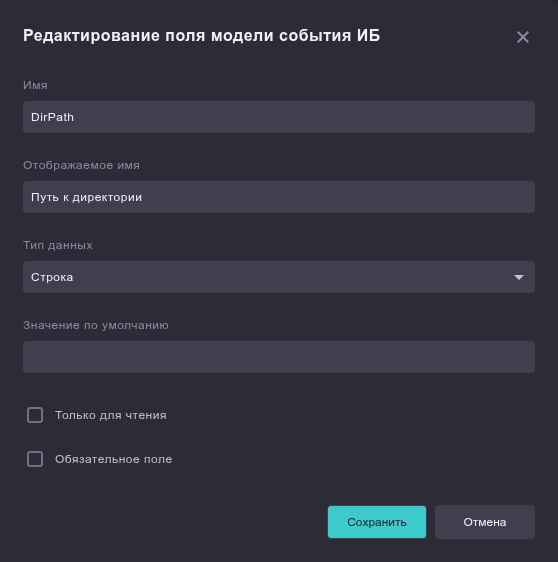

Чекбоксы оставляем нетронутыми. Данное поле позволит нам обогатить карточку события дополнительными данными, а именно - путем к директории, куда был сохранен дамп.

## 1. Настройка операций PowerShell

Операции создаются в интеграции PowerShell (**Настройки → Интеграции → Операции**).
Ниже — десять основных операций сценария: семь работают с локальным хостом, три — с Active Directory.

| № | Операция | Область |
|---|---|---|
| 1 | Получение списка активных сетевых соединений и процессов | Windows (хост) |
| 2 | Поиск подозрительных процессов PowerShell | Windows (хост) |
| 3 | Получение списка активных сессий пользователей | Windows (хост) |
| 4 | Проверка существования директории | Windows (хост) |
| 5 | Принудительное завершение локального процесса | Windows (хост) |
| 6 | Завершение сессии конкретного локального пользователя | Windows (хост) |
| 7 | Принудительное рекурсивное удаление директории | Windows (хост) |
| 8 | Аудит администраторов домена и времени их последнего входа | Windows AD |
| 9 | Блокировка/разблокировка УЗ | Windows AD |
| 10 | Экстренный сброс пароля доменного пользователя | Windows AD |

### Операция 1. Получение списка активных сетевых соединений и процессов

**Описание:** поиск подозрительных установленных соединений на сервере агента с
определением процессов, которые их инициировали.

**Переменные:** нет.

```powershell
$connections = foreach ($line in (netstat -ano)) {
    if ($line -match '^\s*(TCP)\s+(\S+)\s+(\S+)\s+(ESTABLISHED)\s+(\d+)\s*$') {
        $local  = $matches[2]
        $remote = $matches[3]
        $p_id   = $matches[5]

        $localPort    = ($local -split ':')[-1]
        $localAddress = ($local -split ":$localPort")[0]
        $remotePort    = ($remote -split ':')[-1]
        $remoteAddress = ($remote -split ":$remotePort")[0]

        $procName = (Get-Process -Id $p_id -ErrorAction SilentlyContinue).Name

        [ordered]@{
            LocalAddress  = $localAddress
            LocalPort     = $localPort
            RemoteAddress = $remoteAddress
            RemotePort    = $remotePort
            Process       = $procName
        }
    }
}

if ($connections) {
    $connections | ConvertTo-Json -Compress
} else {
    "[]"
}
```

### Операция 2. Поиск подозрительных процессов PowerShell

**Описание:** вывод всех активных процессов PowerShell на хосте агента с отображением
полных командных строк запуска — нужно для выявления обфусцированного вредоносного
кода.

**Переменные:** нет.

```powershell
$processes = try {
    $searcher = [wmisearcher]"SELECT ProcessId, CommandLine, ParentProcessId FROM Win32_Process WHERE Name = 'powershell.exe' or Name = 'pwsh.exe'"
    $searcher.Get() | ForEach-Object {
        [ordered]@{
            ProcessId       = $_.Properties['ProcessId'].Value
            CommandLine     = $_.Properties['CommandLine'].Value
            ParentProcessId = $_.Properties['ParentProcessId'].Value
        }
    }
} catch {
    try {
        Get-WmiObject -Class Win32_Process -Filter "Name = 'powershell.exe' or Name = 'pwsh.exe'" | ForEach-Object {
            [ordered]@{
                ProcessId       = $_.ProcessId
                CommandLine     = $_.CommandLine
                ParentProcessId = $_.ParentProcessId
            }
        }
    } catch {
        $wmicOutput = wmic process where "name='powershell.exe' or name='pwsh.exe'" get CommandLine,ParentProcessId,ProcessId /format:csv 2>$null
        if ($wmicOutput) {
            $wmicOutput | Select-Object -Skip 2 | ForEach-Object {
                $parts = $_ -split ',' | Where-Object { $_ }
                if ($parts.Count -ge 3) {
                    [ordered]@{
                        ProcessId       = $parts[-1].Trim()
                        CommandLine     = $parts[1].Trim()
                        ParentProcessId = $parts[2].Trim()
                    }
                }
            }
        }
    }
}

if ($processes) {
    $processes | ConvertTo-Json -Compress
} else {
    "[]"
}
```

!!! tip "Тройной fallback"
    Скрипт последовательно пробует WMI-searcher → `Get-WmiObject` → `wmic`. Это
    защищает операцию от расхождений в возможностях PowerShell/WMI на разных версиях
    Windows и старых образах, где `Get-WmiObject` уже удалён.

### Операция 3. Получение списка активных сессий пользователей

**Описание:** сбор списка всех пользователей, имеющих в данный момент активные RDP или интерактивные сессии на сервере агента.

**Переменные:** нет.

```powershell
quser 2>$null
```

### Операция 4. Проверка наличия директории

**Описание:** проверка существования пути через Test-Path на сервере агента.

**Переменные:** `dirPath` (строка).

```powershell
$targetPath = "{{dirPath}}"

# Проверка, что путь существует и является именно папкой
if (Test-Path -Path $targetPath -PathType Container) {
    Write-Host "[+] Директория существует: $targetPath"
} else {
    Write-Host "[-] Директория не найдена: $targetPath"
}
```

### Операция 5. Принудительное завершение локального процесса

**Описание:** аварийная остановка вредоносного процесса на хосте агента по его имени.

**Переменные:** `ProcessName` (строка).

```powershell
Stop-Process -Name "{{ProcessName}}" -Force
```

### Операция 6. Завершение сессии конкретного локального пользователя

**Описание:** принудительный сброс активного RDP-подключения пользователя на хосте
агента.

**Переменные:** `Username` (строка).

```powershell
$session = (quser | Select-String "{{Username}}").ToString() -split ' +'
logoff $session[2]
```

### Операция 7. Принудительное рекурсивное удаление директории

**Описание:** принудительное рекурсивное удаление директории со снятием с файла всех аттрибутов.

**Переменные:** `dirPath` (строка).

```powershell
$targetPath = "{{dirPath}}"

if (Test-Path -LiteralPath $targetPath) {
    try {
        # Снимаем атрибуты ReadOnly и Hidden со всех вложенных файлов и папок
        Get-ChildItem -LiteralPath $targetPath -Recurse -Force -ErrorAction SilentlyContinue | ForEach-Object {
            $_.Attributes = 'Normal'
        }

        # Рекурсивное и принудительное удаление содержимого и самого каталога
        Remove-Item -LiteralPath $targetPath -Recurse -Force -ErrorAction Stop

        Write-Output "Каталог успешно удален: $targetPath"
    }
    catch {
        Write-Error "Не удалось удалить каталог $targetPath. Ошибка: $_"
    }
} else {
    Write-Output "Каталог не найден: $targetPath"
}
```
    

### Операция 8. Аудит администраторов домена и времени их последнего входа

**Описание:** сбор списка учётных записей из группы «Domain Admins» с проверкой
времени их последней аутентификации.

**Переменные:** нет.

```powershell
Get-ADGroupMember -Identity "Domain Admins" |
    ForEach-Object { Get-ADUser -Identity $_.SamAccountName -Properties LastLogonDate } |
    Select-Object SamAccountName, Name, LastLogonDate, Enabled
```

### Операция 9. Блокировка/разблокировка УЗ

**Описание:** блокировка или разблокировка учётной записи в домене.

**Переменные:** `Username` (строка), `Enabled` (логический).

```powershell
Set-ADUser -Identity {{Username}} -Enabled ${{Enabled}}
```

### Операция 10. Экстренный сброс пароля доменного пользователя

**Описание:** смена пароля пользователя на случайный временный с требованием
обязательной смены при следующем входе в сеть.

**Переменные:** `Username` (строка), `TempPassword` (строка).

```powershell
$SecPassword = ConvertTo-SecureString "{{TempPassword}}" -AsPlainText -Force
Set-ADAccountPassword -Identity "{{Username}}" -NewPassword $SecPassword -Reset
Set-ADUser -Identity "{{Username}}" -ChangePasswordAtLogon $true
```

!!! danger "Деструктивные операции"
    Операции 5, 6, 7, 9 и 10 необратимо меняют состояние хоста, сессии или учётной
    записи, в том числе в Production-среде (kill процесса, разрыв RDP-сессии, блокировка УЗ, сброс пароля).
    В сценарии реагирования они должны запускаться только на этапах **Локализации**
    и **Восстановления**, никогда — на этапе идентификации.

## 2. Настройка операции получения данных по LDAP

Для того, чтобы получить более подробную информацию о пользователе в Active Directory, следует настроить прямую интеграцию по протоколу **LDAP**. Это можно сделать с помощью создания одноименной интеграции.

Во вкладке **Подключение** указывается:
- FQDN LDAP-сервера (например, полное имя одного из контроллеров домена);
- порт: `389` в случае подключения по нешифрованному каналу (что **не** рекомендуется) или `636` при использовании TLS и выставленному чек-боксу **Использование безопасного подключения**;
- директория поиска (Base DN): distinguishedName организационной единицы, может быть корнем домена (например, `DC=lab,DC=local`);
- имя пользователя и его пароль. Пользователь должен обладать возможностью листинга сущностей и просмотра их аттрибутов.

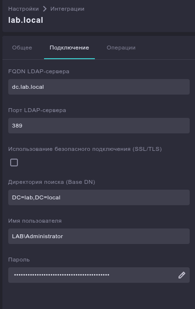

### Получение информации о пользователе из AD

**Переменные:** `Username` (строка)

**Директория поиска (Base DN):** distinguishedName организационной единицы, в которой находятся пользователи. Может соответствовать общей настройке, или быть более уточненным.

**Запрашиваемые аттрибуты:** `memberOf`, `userAccountControl`, `lastLogonTimestamp`, `pwdLastSet`, `badPwdCount`, `adminCount`, `sAMAccountName`, `displayName`, `mail`, `title`, `department`, `distinguishedName`, `whenCreated`. Можно добавить свои, если требуются.

**Текст запроса:** `(&(objectCategory=person)(objectClass=user)(sAMAccountName={{username}}))` 

**Схема данных результата:** нажимаем на кнопку **Создать**, далее заполняем  поле параметра **username** логином заведомо существующего пользователя и нажимаем на пиктограмму в правом верхнем углу. В случае, если все параметры были заданы корректно, данные будут успешно получены и преобразованы в схему.

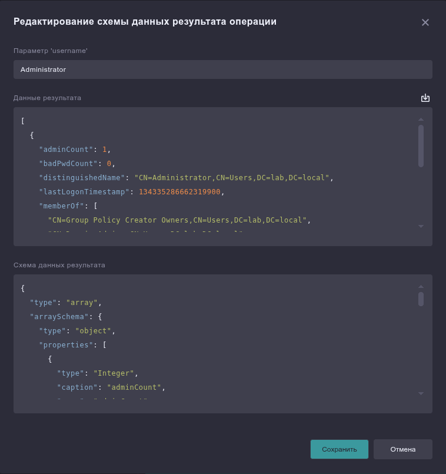

## 3. Настройка визуализаций

Визуализации настраиваются в **Настройки → Визуализации** и используются скриптами
идентификации, чтобы приложить к инциденту наглядную картину авторизаций на хосте.

### Визуализация 1. «Авторизация на хосте — круговая диаграмма»

| Блок | Параметр | Значение |
|---|---|---|
| Общее | Имя | Авторизация на хосте - круговая диаграмма |
| Схема данных | Тип источника | Анализ данных |
| Настройки | Тип | Круговая диаграмма |
| Настройки | Поле | Destination User Name |
| Настройки | Метрика | Count |
| Настройки | Аргумент метрики | All rows |


### Визуализация 2. «Авторизация на хосте — столбчатая диаграмма»

| Блок | Параметр | Значение |
|---|---|---|
| Общее | Имя | Авторизация на хосте - Столбчатая диаграмма |
| Схема данных | Тип источника | Анализ данных |
| Настройки | Тип | Столбчатая диаграмма с накоплением |
| Горизонтальная ось | Поле | Collected Date |
| Горизонтальная ось | Интервал группировки | Час |
| Горизонтальная ось | Сортировка / порядок | Collected Date, по возрастанию |
| Вертикальная ось | Агрегатные функции | count all rows |
| Серия | Поле | Destination User Name |


### Визуализация 3. «LDAP - Информация о пользователе»

| Блок | Параметр | Значение |
|---|---|---|
| Общее | Имя | LDAP - Информация о пользователе |
| Схема данных | Тип источника | Сохраненная схема операции интеграции |
| Схема данных | Источник | Операция "Получение данных о пользователе из AD" операции "LDAP" |
| Настройки | Тип | Карточка |
| Настройка карточки | Поля | Перемещаем на свое усмотрение порядок предоставления полей |
| Настройка карточки | Количество колонок | Ставим на свое усмотрение, от 2 до 4 колонок |

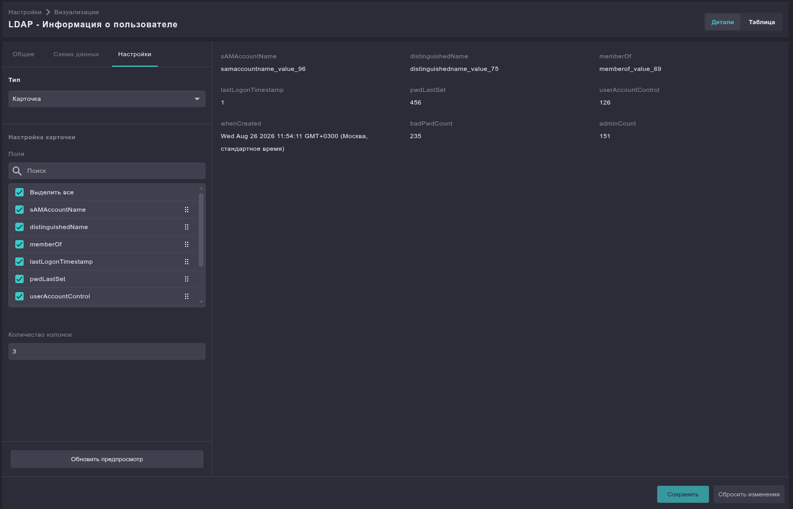

## 4. Настройка скриптов

Скрипты (**Настройки → Скрипты**) — это оркестрация: каждый шаг вызывает операцию
интеграции или визуализацию и передаёт данные дальше по цепочке. Во всех трёх
скриптах точка входа принимает один и тот же входной параметр — `se` типа
**«Событие ИБ»**, то есть сработавшее событие `NTDS.dit dumping using ntdsutil utility`, из которого скрипты достают имя хоста и имя учётной записи.

### Скрипт 1. «ntds.dit — идентификация»

Собирает контекст вокруг события, ничего не меняя на хосте.

**Переменные скрипта:**

| Имя | Тип | Значение |
|---|---|---|
| `$Now` | Дата и время | `now()` |
| `$From` | Дата и время | `addHours($Now, -24)` |

**Точка входа:** параметр `se`, тип «Событие ИБ».

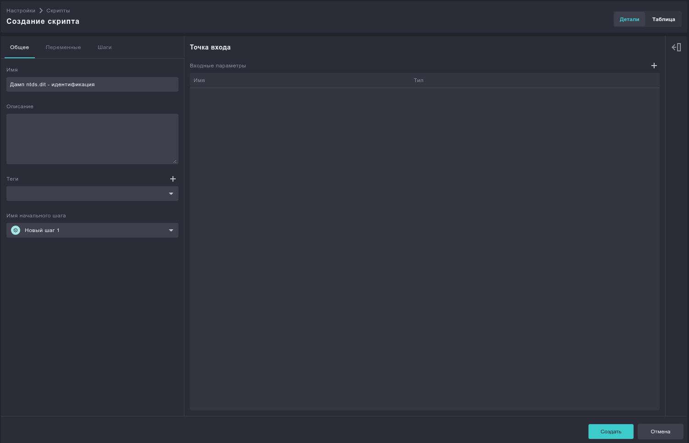


**Шаги:**

1. **Получение активных сессий на хосте** — запуск интеграции PowerShell, операция
   «Получение списка активных сессий пользователей».

    

2. **Авторизации на хосте — круговая диаграмма** — запуск интеграции «Анализ
   данных», операция «Получить значения из анализа данных», визуализация —
   круговая диаграмма из блока 2. Параметры:
     - `offset` = `0` (константа), `limit` = `1000` (константа);
     - `fromdate` = `$From`, `todate` = `$Now` (переменные);
     - фильтр: `Destination Host ID equals se` (имя системы из входного события)
       **или** `Event ID equals 4624` (успешный вход, константа).

    

3. **Авторизации на хосте — столбчатая диаграмма** — тот же вызов «Получить
   значения из анализа данных» с идентичными фильтром и параметрами, но с
   визуализацией-столбчатой диаграммой из блока 2 (скриншот этого шага не
   приводим — он совпадает с предыдущим с точностью до выбранной визуализации).

4. **Получение списка активных сетевых соединений и процессов** — запуск
   интеграции PowerShell, операция «Получение списка активных сетевых
   соединений и процессов».

    

5. **Получение данных о пользователе из AD** - запуск интеграции LDAP, c одноименной операцией. В качестве входного параметра будет выступать поле `se - Назначение: Имя учетной записи`. Настраиваем визуализацию «LDAP - информация о пользователе», чтобы вывод был более привлекательным.

    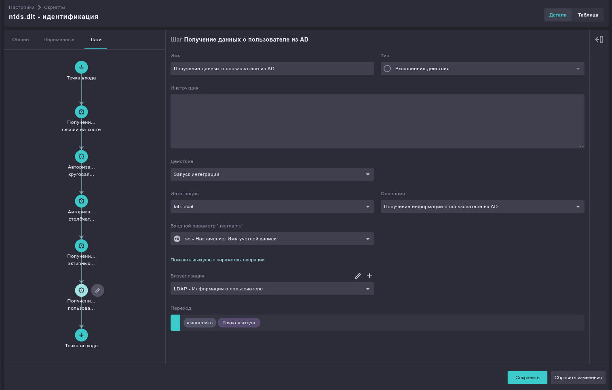

6. **Проверка наличия директории** - запуск интеграции Powershell, операция «Проверка наличия директории». В качестве входного параметра будет выступать поле `se - Путь к директории`.
    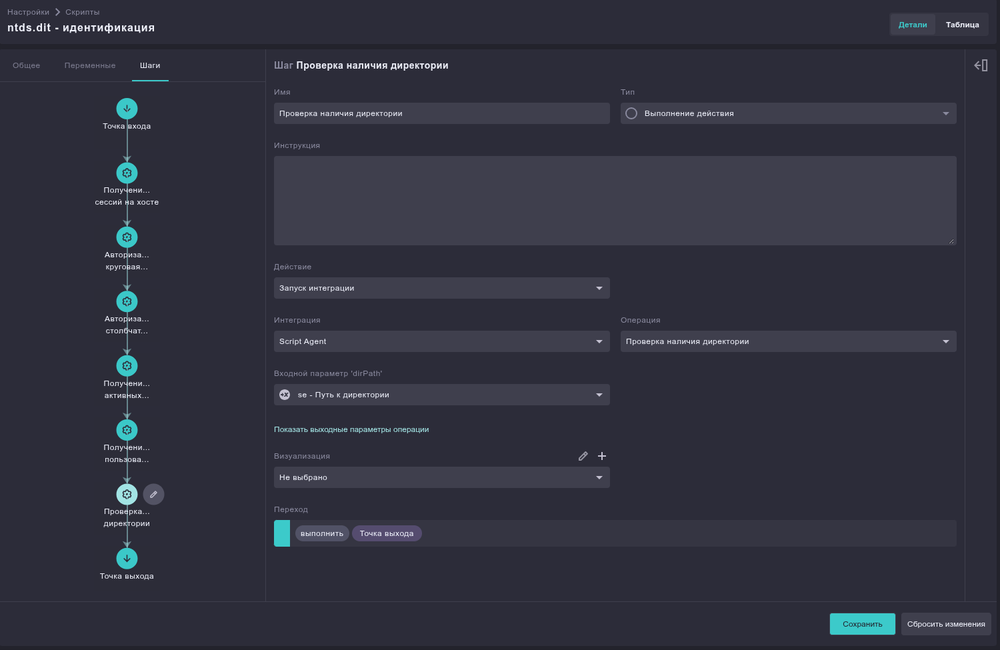

7. Переход в точку выхода.

### Скрипт 2. «ntds.dit — локализация»

Останавливает активность скомпрометированной учётной записи и очищает папку с дампом учетных записей Active Directory.

**Точка входа:** параметр `se`, тип «Событие ИБ».

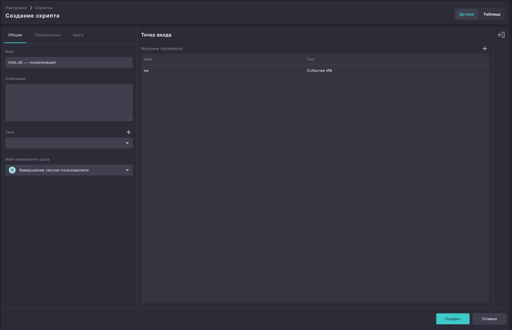

**Шаги:**

1. **Завершение сессии пользователя** — запуск интеграции PowerShell, операция
   «Завершение сессии конкретного локального пользователя». Параметр `Username` =
   `se` (Назначение: имя учётной записи из входного параметра).

    

2. **Блокировка доменной УЗ пользователя** — запуск интеграции PowerShell, операция
   «Блокировка/разблокировка УЗ». Параметр `Username` = `se` (Назначение: имя учётной записи),
   `Enabled` = `false` (константа).

    

3. **Удаление папки** — запуск интеграции PowerShell, операция «Рекурсивное удаление папки». Параметр `dirPath` = `se` - Путь к директории.

    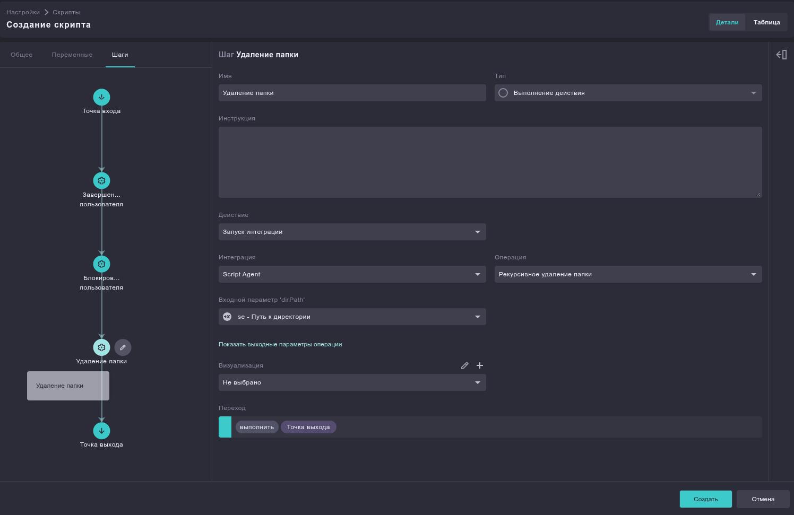

4. Переход в точку выхода.

### Скрипт 3. «ntds.dit — локализация»

Возвращает учётную запись в рабочее состояние после разбора инцидента.

**Точка входа:** параметр `se`, тип «Событие ИБ».


**Шаги:**

1. **Разблокировка доменной УЗ пользователя** — запуск интеграции PowerShell,
   операция «Блокировка/разблокировка УЗ». Параметр `Username` = `se` (Назначение: имя учётной
   записи), `Enabled` = `true` (константа).

    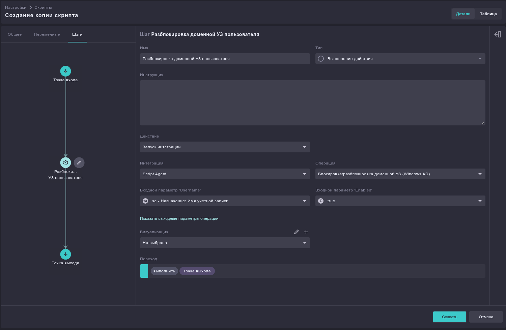

2. Переход в точку выхода.

## 5. Настройка сценария реагирования

Сценарий реагирования (**Работа с инцидентами → Сценарии реагирования**) связывает три скрипта с этапами жизненного цикла инцидента.

**Имя:** Дамп ntds.dit. **Регламент:** Регламент обработки СИБ.

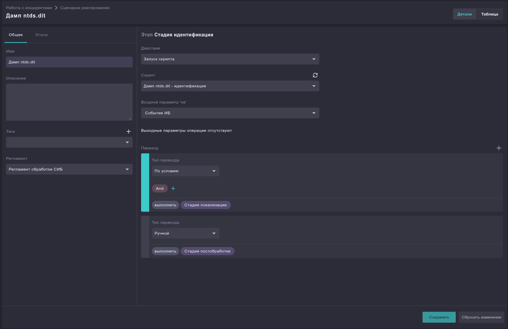

| Этап | Действие | Переход |
|---|---|---|
| Идентификация | Запуск скрипта «Дамп ntds.dit — идентификация» (параметр `se` — Событие ИБ) | По условию (безусловно) → Локализация |
| Локализация | Запуск скрипта «Дамп ntds.dit — локализация» (параметр `se` — Событие ИБ) | По условию (безусловно) → Уничтожение |
| Уничтожение | Действие не задано — точка для ручного решения аналитика | Вручную → Восстановление **или** вручную → Финальный этап |
| Восстановление | Запуск скрипта «Дамп ntds.dit — восстановление» (параметр `se` — Событие ИБ) | По условию (безусловно) → Финальный этап |
| Финальный этап | — | — |

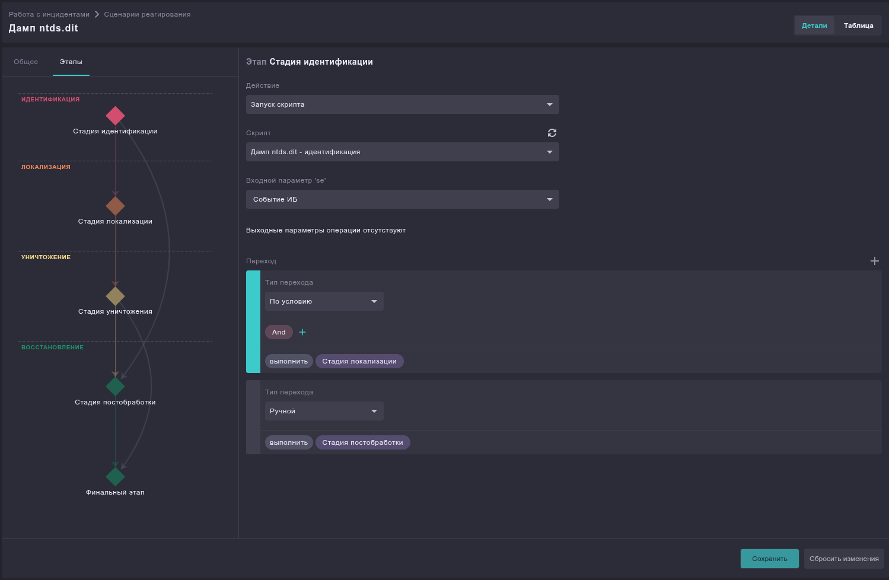
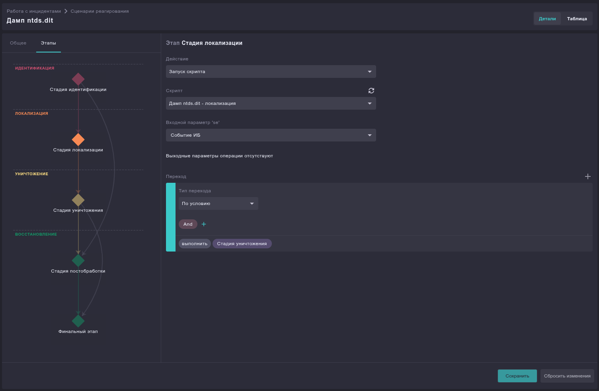
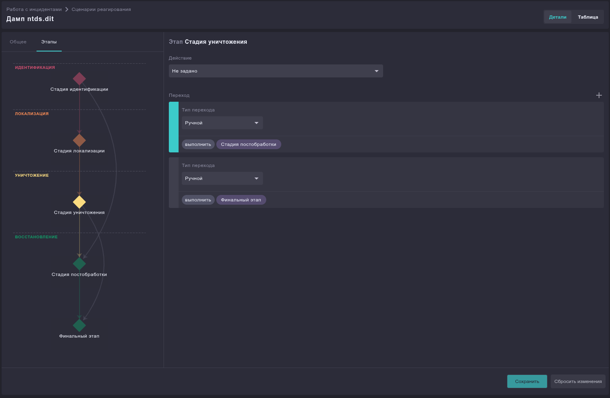
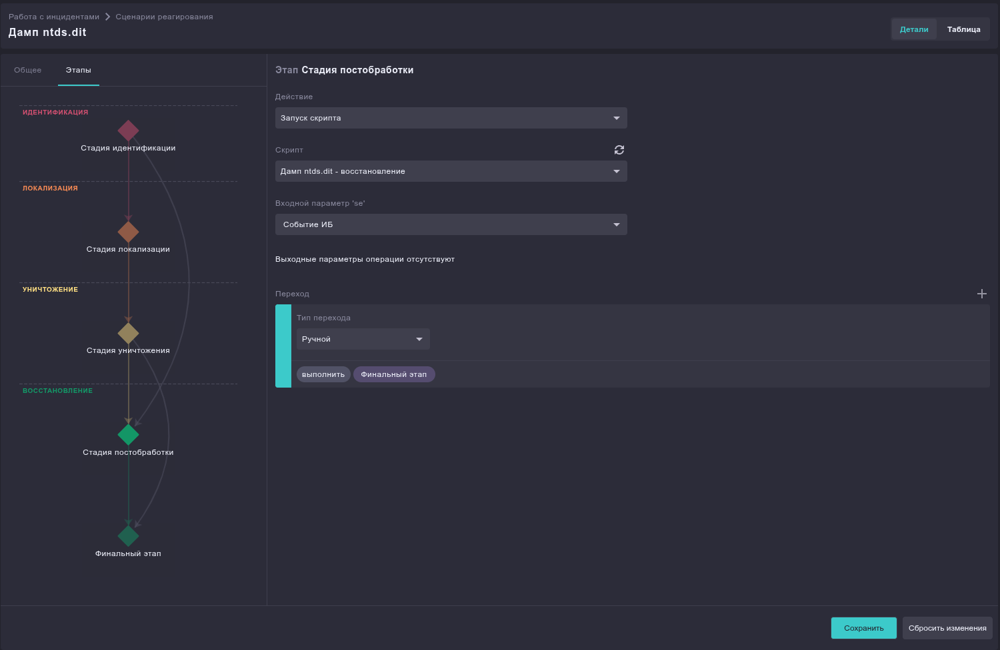

Этап «Уничтожение» намеренно оставлен без автоматизации: сброс пароля
или другие деструктивные шаги отдаются на усмотрение аналитика после того, как
идентификация подтвердила инцидент, а не выполняются автоматически.

## 6. Настройка детектирования СИБ

Три точки конфигурации нужно свести вместе, чтобы событие `TH_073 NTDS.dit dumping using ntdsutil utility` превращалось в инцидент с уже привязанным сценарием реагирования.

### 6.1. Правило создания событий ИБ

1. **Работа с инцидентами → Правила создания событий ИБ** → открыть правило
   `WorkFlow_CreateNewSecurityEvent` и включить его.

2. Сначала добавляем выражение, с помощью которого мы будем извлекать путь к папке, куда сохранился дамп. Для этого в правой колонке **Выражения** стоит добавить новое выражение со следующими параметрами: Имя - `dirPath`; Тип значения - `Строка`; Функция - `extractRegex`, строка - поле `Process Command Line`, regex - `[a-zA-Z]:\\[^'"\s]+(?=['"]?\s+q\s+q)`.
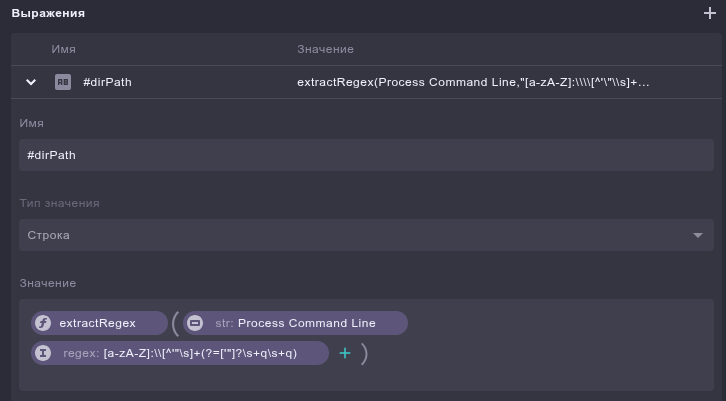

 
3. В блоке **Фильтр** необходимо добавить дополнительное условие, чтобы правило корреляции срабатывало только от имени пользователя. Для этого добавляем условие:
`Or Detection Id Does not equal TH_073 (Detection Id Equals TH_073 Or Source User Name Does not end with $)`
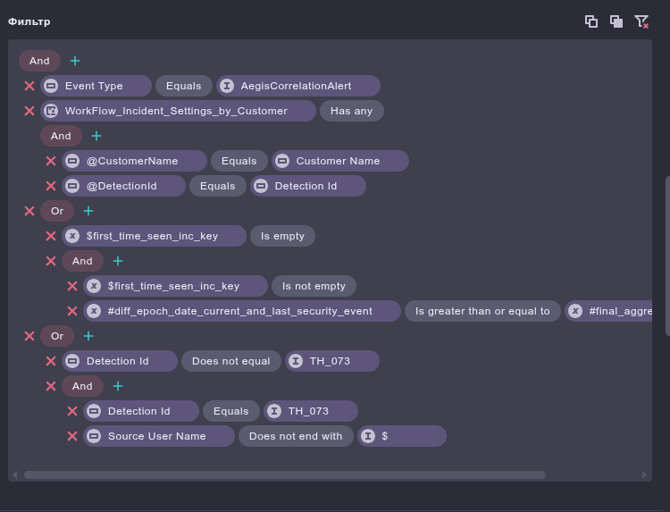

4. В блоке **«Правила переопределения значений свойств»** добавить условие:
   `Detection Id equals TH_073` →
   `Сценарий реагирования` = **Дамп ntds.dit**; `Путь к директории` = **#dirPath**

    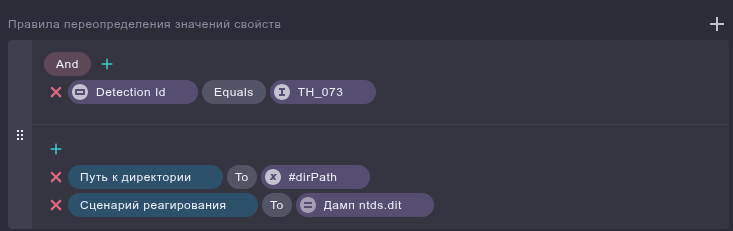

### 6.2. Агрегация инцидента

**Детектирование → Стандартные справочники → `WorkFlow_Incident_Settings_by_Customer`**
→ найти строку `INC_073` → выставить `AggregationTime` в миллисекундах (например,
`1000`).

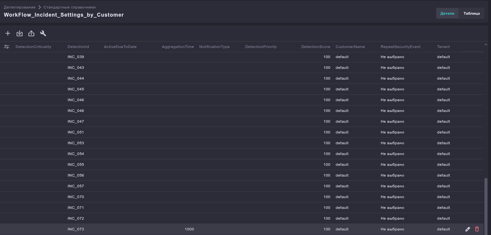

## 7. Генерация тестового инцидента

Проверка всей цепочки — сымитировать саму технику атаки на хосте, где установлен **Script Agent**. Конечно же, данный хост должен быть контроллером Active Directory:

1. Откройте интерпретатор Powershell от имени администратора.

2. Выполните команду `ntdsutil.exe 'ac i ntds' 'ifm' 'create full c:\ntdsdump' q q`.

    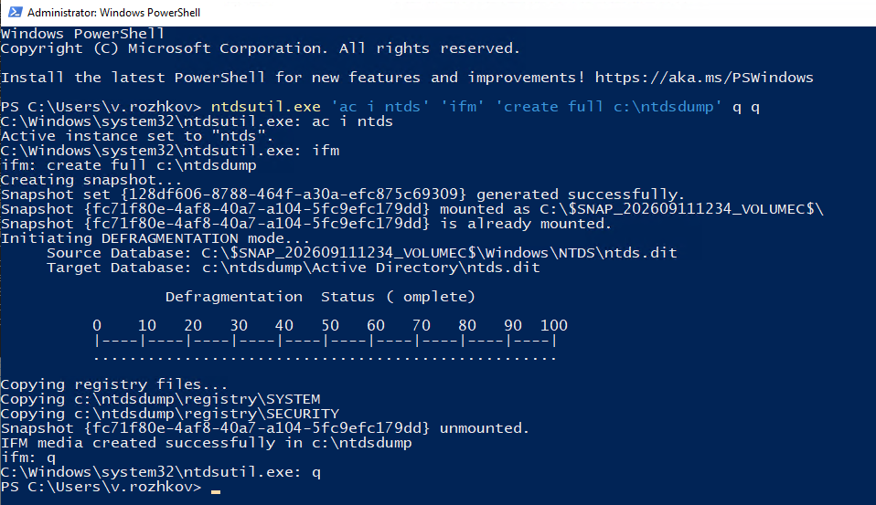

3. Будет выполнен дамп Active Directory Domain Database в папку `C:\ntdsdump`.

!!! danger "Только в тестовом контуре"
    Выполняемая команда — это то самое действие, которое сценарий должен детектировать. Выполняйте шаг исключительно в тестовом контуре: обычно это действие злоумышленника, а не рутинная операция обслуживания.

После этого действия ожидаемая цепочка выглядит так: агент собирает событие
запуска команды `ntdsutil` → правило
`WorkFlow_CreateNewSecurityEvent` создаёт событие ИБ и по `Detection Id = INC_073`
привязывает сценарий «Дамп ntds.dit» → инцидент агрегируется по настроенному
`AggregationTime` → сценарий реагирования последовательно проходит
Идентификацию, Локализацию и — после решения аналитика на этапе Уничтожения — Восстановление.

Если инцидент не создался или сценарий не запустился — в первую очередь проверьте
пункты 6.1–6.2: это самые частые точки ошибки при повторной настройке сценария.
