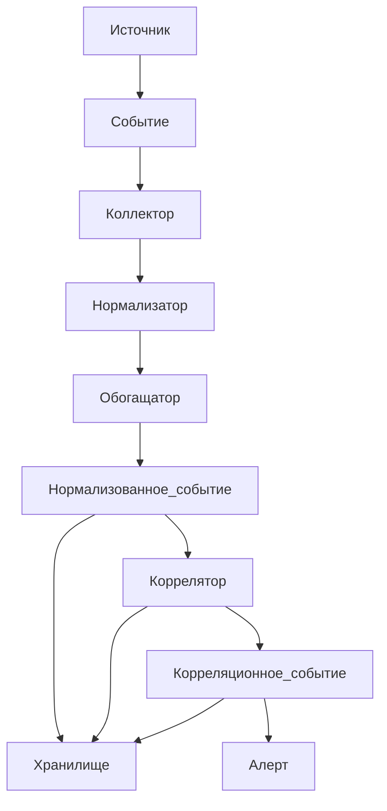

# Процесс обработки событий SIEM

В [прошлой статье](what_is_siem.md) мы с вами поговорили о том, что такое SIEM. Теперь мы можем подробнее поговорить о том, какой путь проходит событие, начиная от источника, заканчивая тем, как мы его видим в системе

Для этого посмотрим на схему:

А теперь давайте шаг за шагом пройдемся по этой схеме.

# 1. Генерация событий

Глобально есть несколько основных форматов логов, которые могут писать истоничники:

## Syslog

Пример лога:
><34>1 2026-10-11T22:14:15.003Z mymachine.example.com su 12345 ID47 [authWorker@48577 ip="192.168.1.50"] 'su root' failed for user joe

Первое число в <> - Priority

Объединяет категорию источника (тип службы, отправляющей запись журнала, например, auth) и уровень серьезности (например, critical, error, info) в одно число

Следующее число после > - версия заголовка syslog

Далее всегда идет Timestamp - время генерации события на источнике

Следующее - имя хоста 

Все, что дальше - сообщение, оно может быть абсолютно произвольным или являться другим форматом логов, которые мы посмотрим дальше

## CEF

Пример лога: 

>CEF:0|UserGate|NGFW|7|webaccess|log|6|rt=1652344423822 deviceExternalId=utmcore@firewall01 act=allow src=192.168.1.50 dst=194.226.127.130 dpt=443 suser=jdoe

# 2. Сбор событий

Сбор событий бывает пассивный и активный. 

Активный - SIEM сам ходит к источнику и забирает события через коннекторы

Пассивный - SIEM создает точку сбора и принимает события с источника

## Файлом

## Агентом

## API

## Из базы данных

## Syslog

# 3. Нормализация

# 4. Обогащение

# 5. Корреляция

# 6. Хранение